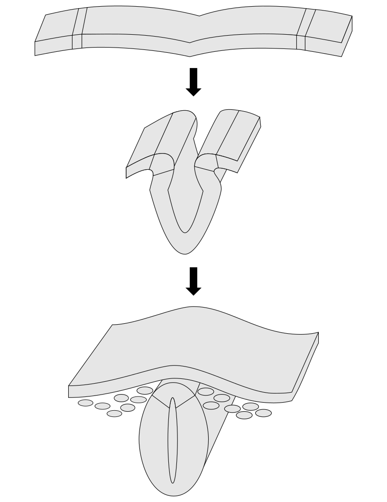

# Development Of The Nervous System

In this laboratory session, we will study the anatomy of the developing dervous system. 

Below, you will be presented with a number of figures and asked to label or color certain structures in each figure.


In Figure \@ref(fig:neurulationlabel)

1. Color the neural plate red
1. Color the neural tube red
1. Color the neural groove red
2. Color the epidermis green
1. Color the neural crest and neural crest cells green
3. Color the neural plate border blue 
1. Color the the neural fold blue

(ref:neurulab) [A diagram of the stages of neural tube formation.](https://en.wikipedia.org/wiki/Neural_tube#/media/File:Neural_crest.svg)
        
```{r neurulationlabel, fig.cap='(ref:neurulab)', echo=FALSE, message=FALSE, warning=FALSE}

```

In Figure \@ref(fig:braindevlabel) label the following structures

1. The prosencephalon
1. The mesencephalon
1. The roof of the mesencephalon
1. The rhombencephalon
1. The metencephalon
1. The myelencephalon
1. The spinal cord
1. The telencephalon
1. The diencephalon
1. The cranial and spinal ganglia
1. The cephalic flexure
1. The cervical flexure
1. The optic vesicle
1. The 3^d^ ventricle
1. The lateral ventricles
1. The (future) cerebral aqueduct
1. The 4^th^ ventricle
1. The central canal
1. The cerebellum
1. The choroid plexus
1. The epiphysis
1. The hypophysis

(ref:braindevlab) Development of the mammalian brain. The development of the three primary brain vesicles on gestational day (GD) 10.5 in rats (top left) and GD 26± 1 in humans (top right). The more mature brain with five brain vesicles: the horizontal and lateral views correspond to GD11.5 in rats (middle left) and GD 33 ± 1 in humans (middle right). Bottom left: The lateral view shows the migratory paths from the more central ventricularzone and gradients maturation of the neocortex (arrows). Bottom right: The midsagittal view of the brain and spinalcord, with the major divisions delineated and the continuity of the ventricles noted; the formation of the choroid plexus corresponds to GD 13.5 in rats (left) and GD 48-51 in humans (right). Adapted from [Rice and Barone](https://www.ncbi.nlm.nih.gov/pubmed/10852851).

```{r braindevlabel, fig.cap='(ref:braindevlab)', echo=FALSE, message=FALSE, warning=FALSE}
knitr::include_graphics("./figures/development/brain_development_for_labeling.svg")
```


