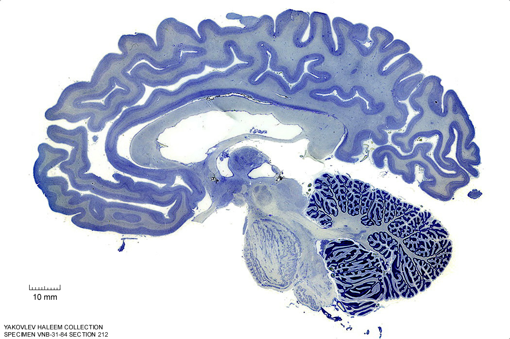
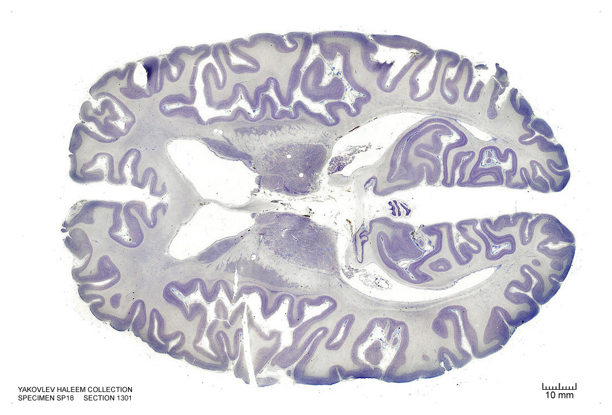
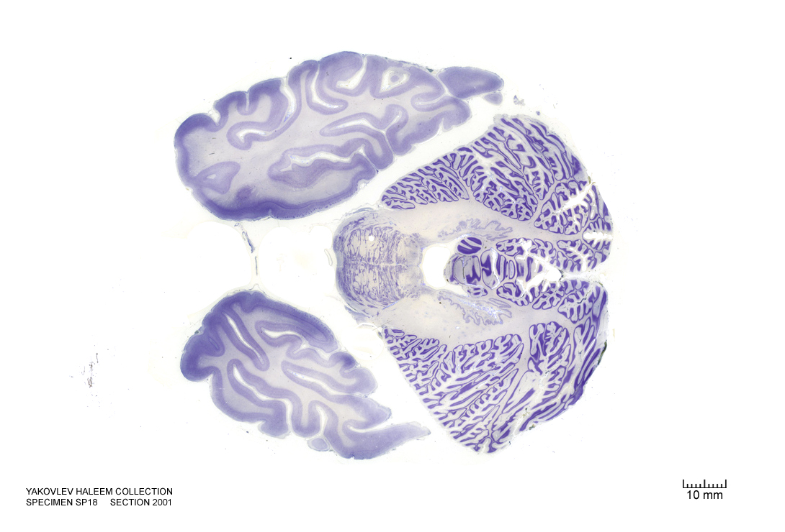

#  The Diencephalon

In this laboratory session, we will study the anatomy of the human diencephalon. The diencephalon is a division of the forebrain (embryonic prosencephalon), and is situated between the telencephalon and the midbrain (embryonic mesencephalon). It consists of structures that are on either side of the third ventricle, including the thalamus, the hypothalamus, the epithalamus and the subthalamus.

Below, you will be presented with a number of figures and asked to label or color certain structures in each figure.

## A Series Of Coronal Sections Of A Human Brain 

In Figure \@ref(fig:1520), label the following structures:

1. The optic nerves (left and right)

```{r 1520, fig.cap='(ref:c1520)', echo=FALSE, message=FALSE, warning=FALSE}
knitr::include_graphics("./figures/cns/1520_cell.jpg")
```

In Figure \@ref(fig:1680), label the following structures:

1. The preoptic area
1. The optic chiasm
1. The infundibular stalk
1. The 3^d^ ventricle
1. The internal capsule
1. The external capsule

```{r 1680, fig.cap='(ref:c1680)', echo=FALSE, message=FALSE, warning=FALSE}
knitr::include_graphics("./figures/cns/1680_cell.jpg")
```

In Figure \@ref(fig:`1840`), label the following structures:

1. The thalamus
1. The hypothalamus

(ref:c1840) Coronal section from [The Human Brain Atlas](https://msu.edu/~brains/brains/human/index.html) at the [Michigan State University Brain Biodiveristy Bank](https://msu.edu/~brains/copyright.html) which [acknowledges](https://msu.edu/~brains/copyright.html) their support from the National Science Foundation. 


```{r 1840, fig.cap='(ref:c1840)', echo=FALSE, message=FALSE, warning=FALSE}
knitr::include_graphics("./figures/cns/1840_cell.jpg")
```

In Figure \@ref(fig:2000), label the following structures:


(ref:c2000) Coronal section from [The Human Brain Atlas](https://msu.edu/~brains/brains/human/index.html) at the [Michigan State University Brain Biodiveristy Bank](https://msu.edu/~brains/copyright.html) which [acknowledges](https://msu.edu/~brains/copyright.html) their support from the National Science Foundation. 

1. The thalamus
1. The 3^d^ ventricle
1. The subthalamic nucleus
1. The zona incerta

```{r 2000, fig.cap='(ref:c2000)', echo=FALSE, message=FALSE, warning=FALSE}
knitr::include_graphics("./figures/cns/2000_cell.jpg")
```

In Figure \@ref(fig:2060), label the following structures:

1. The thalamus
1. The 3^d^ ventricle
1. The internal capsule
1. The external capsule
1. The subthalamic nucleus
1. The zona incerta

(ref:c2060) Coronal section from [The Human Brain Atlas](https://msu.edu/~brains/brains/human/index.html) at the [Michigan State University Brain Biodiveristy Bank](https://msu.edu/~brains/copyright.html) which [acknowledges](https://msu.edu/~brains/copyright.html) their support from the National Science Foundation. 


```{r 2060, fig.cap='(ref:c2060)', echo=FALSE, message=FALSE, warning=FALSE}
knitr::include_graphics("./figures/cns/2060_cell.jpg")
```

In Figure \@ref(fig:2240), label the following structures:

1. The habenula
1. The pineal gland
1. The medial geniculate nucleus
1. The lateral geniculate nucleus
1. The posterior commissure
1. The cerebral aqueduct

(ref:c2240) Coronal section from [The Human Brain Atlas](https://msu.edu/~brains/brains/human/index.html) at the [Michigan State University Brain Biodiveristy Bank](https://msu.edu/~brains/copyright.html) which [acknowledges](https://msu.edu/~brains/copyright.html) their support from the National Science Foundation. 


```{r 2240, fig.cap='(ref:c2240)', echo=FALSE, message=FALSE, warning=FALSE}
knitr::include_graphics("./figures/cns/2240_cell.jpg")
```

In Figure \@ref(fig:2390), label the following structures:

1. The thalamus
1. The pineal gland
1. The periaqueductal grey matter
1. The cerebral aqueduct
1. The pulvinar

(ref:c2390) Coronal section from [The Human Brain Atlas](https://msu.edu/~brains/brains/human/index.html) at the [Michigan State University Brain Biodiveristy Bank](https://msu.edu/~brains/copyright.html) which [acknowledges](https://msu.edu/~brains/copyright.html) their support from the National Science Foundation. 


```{r 2390, fig.cap='(ref:c2390)', echo=FALSE, message=FALSE, warning=FALSE}
knitr::include_graphics("./figures/cns/2390_cell.jpg")
```

##  A Series Of Sagittal Sections Of A Human Brain  

In Figure \@ref(fig:392), label the following structures:

1. The thalamic nuclei
  * pulvinar
  * ventral group
  * centromedian gropup
1. The subthalamic nucleus

(ref:s392) Sagittal section from [The Human Brain Atlas](https://msu.edu/~brains/brains/human/index.html) at the [Michigan State University Brain Biodiveristy Bank](https://msu.edu/~brains/copyright.html) which [acknowledges](https://msu.edu/~brains/copyright.html) their support from the National Science Foundation. 

```{r 392, fig.cap='(ref:s392)', echo=FALSE, message=FALSE, warning=FALSE}
knitr::include_graphics("./figures/cns/0392_cell.jpg")
```


In Figure \@ref(fig:332), label the following structures:

1. The thalamic nuclei
  * anterior group
  * ventral group
  * centromedian gropup
1. The anterior commissure
1. The hypothalamus

(ref:s332) Sagittal section from [The Human Brain Atlas](https://msu.edu/~brains/brains/human/index.html) at the [Michigan State University Brain Biodiveristy Bank](https://msu.edu/~brains/copyright.html) which [acknowledges](https://msu.edu/~brains/copyright.html) their support from the National Science Foundation. 

```{r 332, fig.cap='(ref:s332)', echo=FALSE, message=FALSE, warning=FALSE}
knitr::include_graphics("./figures/cns/0332_cell.jpg")
```


In Figure \@ref(fig:302), label the following structures:

1. The thalamus 
1. The anterior commissure
1. The mammillothalamic tract
1. The hypothalamus

(ref:s302) Sagittal section from [The Human Brain Atlas](https://msu.edu/~brains/brains/human/index.html) at the [Michigan State University Brain Biodiveristy Bank](https://msu.edu/~brains/copyright.html) which [acknowledges](https://msu.edu/~brains/copyright.html) their support from the National Science Foundation. 

```{r 302, fig.cap='(ref:s302)', echo=FALSE, message=FALSE, warning=FALSE}
knitr::include_graphics("./figures/cns/0302_cell.jpg")
```


In Figure \@ref(fig:272), label the following structures:

1. The thalamus 
1. The mammillothalamic tract
1. The hypothalamus

(ref:s272) Sagittal section from [The Human Brain Atlas](https://msu.edu/~brains/brains/human/index.html) at the [Michigan State University Brain Biodiveristy Bank](https://msu.edu/~brains/copyright.html) which [acknowledges](https://msu.edu/~brains/copyright.html) their support from the National Science Foundation. 

```{r 272, fig.cap='(ref:s272)', echo=FALSE, message=FALSE, warning=FALSE}
knitr::include_graphics("./figures/cns/0272_cell.jpg")
```


In Figure \@ref(fig:242), label the following structures:

1. The thalamus 
1. The mammillothalamic tract
1. The hypothalamus

(ref:s242) Sagittal section from [The Human Brain Atlas](https://msu.edu/~brains/brains/human/index.html) at the [Michigan State University Brain Biodiveristy Bank](https://msu.edu/~brains/copyright.html) which [acknowledges](https://msu.edu/~brains/copyright.html) their support from the National Science Foundation. 

```{r 242, fig.cap='(ref:s242)', echo=FALSE, message=FALSE, warning=FALSE}
knitr::include_graphics("./figures/cns/0242_cell.jpg")
```


In Figure \@ref(fig:212), label the following structures:

1. The thalamus 
1. The mammillothalamic tract
1. The hypothalamus

(ref:s212) Sagittal section from [The Human Brain Atlas](https://msu.edu/~brains/brains/human/index.html) at the [Michigan State University Brain Biodiveristy Bank](https://msu.edu/~brains/copyright.html) which [acknowledges](https://msu.edu/~brains/copyright.html) their support from the National Science Foundation. 

```{r 212, fig.cap='(ref:s212)', echo=FALSE, message=FALSE, warning=FALSE}

```


In Figure \@ref(fig:182), label the following structures:

1. The thalamus 
1. The mammillothalamic tract
1. The hypothalamus
1. The habenular commissure

(ref:s182) Sagittal section from [The Human Brain Atlas](https://msu.edu/~brains/brains/human/index.html) at the [Michigan State University Brain Biodiveristy Bank](https://msu.edu/~brains/copyright.html) which [acknowledges](https://msu.edu/~brains/copyright.html) their support from the National Science Foundation. 

```{r 182, fig.cap='(ref:s182)', echo=FALSE, message=FALSE, warning=FALSE}
knitr::include_graphics("./figures/cns/0182_cell.jpg")
```

In Figure \@ref(fig:152), label the following structures:

1. The thalamus 
1. The optic chiasm
1. The mammillothalamic tract
1. The hypothalamus
1. The cerebral aqueduct
1. The posterior commissure


(ref:s152) Sagittal section from [The Human Brain Atlas](https://msu.edu/~brains/brains/human/index.html) at the [Michigan State University Brain Biodiveristy Bank](https://msu.edu/~brains/copyright.html) which [acknowledges](https://msu.edu/~brains/copyright.html) their support from the National Science Foundation. 

```{r 152, fig.cap='(ref:s152)', echo=FALSE, message=FALSE, warning=FALSE}
knitr::include_graphics("./figures/cns/0182_cell.jpg")
```

##  A Series Of Horizontal Sections Of A Human Brain  

In Figure \@ref(fig:1300), label the following structures:

1. The thalamic nuclei
  * reticular
  * ventroposterior
  * ventroanterior
  * ventrolateral
  * mediodorsal
  * anteroprincipal

(ref:h1300) Horizontal section from [The Human Brain Atlas](https://msu.edu/~brains/brains/human/index.html) at the [Michigan State University Brain Biodiveristy Bank](https://msu.edu/~brains/copyright.html) which [acknowledges](https://msu.edu/~brains/copyright.html) their support from the National Science Foundation. 

```{r 1300, fig.cap='(ref:h1300)', echo=FALSE, message=FALSE, warning=FALSE}

```

In Figure \@ref(fig:1400), label the following structures:

1. The thalamic nuclei
  * pulvinar
  * reticular
  * ventroposterior
  * ventroanterior
  * ventrolateral
  * mediodorsal
1. The habenula


(ref:h1400) Horizontal section from [The Human Brain Atlas](https://msu.edu/~brains/brains/human/index.html) at the [Michigan State University Brain Biodiveristy Bank](https://msu.edu/~brains/copyright.html) which [acknowledges](https://msu.edu/~brains/copyright.html) their support from the National Science Foundation. 

```{r 1400, fig.cap='(ref:h1400)', echo=FALSE, message=FALSE, warning=FALSE}
knitr::include_graphics("./figures/cns/horizontal/1400_cell.jpg")
```

In Figure \@ref(fig:1500), label the following structures:

1. The thalamic nuclei
  * pulvinar
  * reticular
1. The 3^d^ ventricle
1. The medial geniculate nucleus
1. The lateral geniculate nucleus

(ref:h1500) Horizontal section from [The Human Brain Atlas](https://msu.edu/~brains/brains/human/index.html) at the [Michigan State University Brain Biodiveristy Bank](https://msu.edu/~brains/copyright.html) which [acknowledges](https://msu.edu/~brains/copyright.html) their support from the National Science Foundation. 

```{r 1500, fig.cap='(ref:h1500)', echo=FALSE, message=FALSE, warning=FALSE}
knitr::include_graphics("./figures/cns/horizontal/1500_cell.jpg")
```

In Figure \@ref(fig:1600), label the following structures:

1. The cerebral aqueduct
1. The mammillothalamic tract
1. The medial geniculate nucleus
1. The lateral geniculate nucleus

(ref:h1600) Horizontal section from [The Human Brain Atlas](https://msu.edu/~brains/brains/human/index.html) at the [Michigan State University Brain Biodiveristy Bank](https://msu.edu/~brains/copyright.html) which [acknowledges](https://msu.edu/~brains/copyright.html) their support from the National Science Foundation. 

```{r 1600, fig.cap='(ref:h1600)', echo=FALSE, message=FALSE, warning=FALSE}
knitr::include_graphics("./figures/cns/horizontal/1600_cell.jpg")
```

In Figure \@ref(fig:1640), label the following structures:

1. The cerebral aqueduct
1. The periaqueductal grey area
1. The 3^d^ ventricle
1. The medial geniculate nucleus
1. The lateral geniculate nucleus

(ref:h1640) Horizontal section from [The Human Brain Atlas](https://msu.edu/~brains/brains/human/index.html) at the [Michigan State University Brain Biodiveristy Bank](https://msu.edu/~brains/copyright.html) which [acknowledges](https://msu.edu/~brains/copyright.html) their support from the National Science Foundation. 

```{r 1640, fig.cap='(ref:h1640)', echo=FALSE, message=FALSE, warning=FALSE}
knitr::include_graphics("./figures/cns/horizontal/1640_cell.jpg")
```

In Figure \@ref(fig:1700), label the following structures:

1. The cerebral aqueduct
1. The periaqueductal grey area
1. The 3^d^ ventricle
1. The medial geniculate nucleus
1. The lateral geniculate nucleus

(ref:h1700) Horizontal section from [The Human Brain Atlas](https://msu.edu/~brains/brains/human/index.html) at the [Michigan State University Brain Biodiveristy Bank](https://msu.edu/~brains/copyright.html) which [acknowledges](https://msu.edu/~brains/copyright.html) their support from the National Science Foundation. 

```{r 1700, fig.cap='(ref:h1700)', echo=FALSE, message=FALSE, warning=FALSE}
knitr::include_graphics("./figures/cns/horizontal/1700_cell.jpg")
```

In Figure \@ref(fig:1740), label the following structures:

1. The cerebral aqueduct
1. The arcuate hypothalamic nucleus
1. The periaqueductal grey area
1. The 3^d^ ventricle
1. The 4^th^ ventricle
1. The raphe nucleus

(ref:h1740) Horizontal section from [The Human Brain Atlas](https://msu.edu/~brains/brains/human/index.html) at the [Michigan State University Brain Biodiveristy Bank](https://msu.edu/~brains/copyright.html) which [acknowledges](https://msu.edu/~brains/copyright.html) their support from the National Science Foundation. 

```{r 1740, fig.cap='(ref:h1740)', echo=FALSE, message=FALSE, warning=FALSE}
knitr::include_graphics("./figures/cns/horizontal/1740_cell.jpg")
```

In Figure \@ref(fig:1800), label the following structures:

1. The arcuate hypothalamic nucleus
1. The infundibular stalk
1. The raphe nuclei
1. The 3^d^ ventricle
1. The optic nerve

(ref:h1800) Horizontal section from [The Human Brain Atlas](https://msu.edu/~brains/brains/human/index.html) at the [Michigan State University Brain Biodiveristy Bank](https://msu.edu/~brains/copyright.html) which [acknowledges](https://msu.edu/~brains/copyright.html) their support from the National Science Foundation. 

```{r 1800, fig.cap='(ref:h1800)', echo=FALSE, message=FALSE, warning=FALSE}
knitr::include_graphics("./figures/cns/horizontal/1800_cell.jpg")
```

In Figure \@ref(fig:ho1840), label the following structures:

1. The 3^d^ ventricle
1. The optic nerve

(ref:h1840) Horizontal section from [The Human Brain Atlas](https://msu.edu/~brains/brains/human/index.html) at the [Michigan State University Brain Biodiveristy Bank](https://msu.edu/~brains/copyright.html) which [acknowledges](https://msu.edu/~brains/copyright.html) their support from the National Science Foundation. 

```{r ho1840, fig.cap='(ref:h1840)', echo=FALSE, message=FALSE, warning=FALSE}
knitr::include_graphics("./figures/cns/horizontal/1840_cell.jpg")
```

In Figure \@ref(fig:1900), label the following structures:

1. The 3^d^ ventricle

(ref:h1900) Horizontal section from [The Human Brain Atlas](https://msu.edu/~brains/brains/human/index.html) at the [Michigan State University Brain Biodiveristy Bank](https://msu.edu/~brains/copyright.html) which [acknowledges](https://msu.edu/~brains/copyright.html) their support from the National Science Foundation. 

```{r 1900, fig.cap='(ref:h1900)', echo=FALSE, message=FALSE, warning=FALSE}
knitr::include_graphics("./figures/cns/horizontal/1900_cell.jpg")
```

In Figure \@ref(fig:ho2000), label the following structures:

1. The 3^d^ ventricle

(ref:h2000) Horizontal section from [The Human Brain Atlas](https://msu.edu/~brains/brains/human/index.html) at the [Michigan State University Brain Biodiveristy Bank](https://msu.edu/~brains/copyright.html) which [acknowledges](https://msu.edu/~brains/copyright.html) their support from the National Science Foundation. 

```{r ho2000, fig.cap='(ref:h2000)', echo=FALSE, message=FALSE, warning=FALSE}

```


