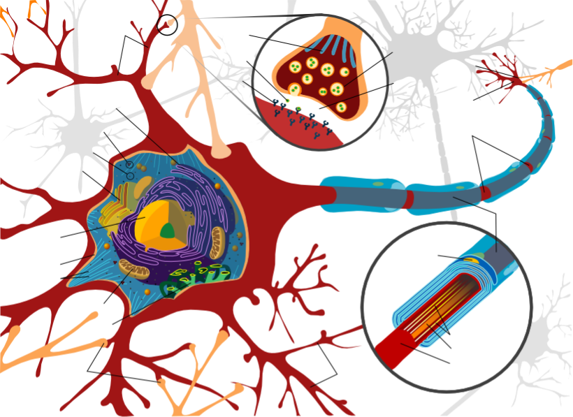
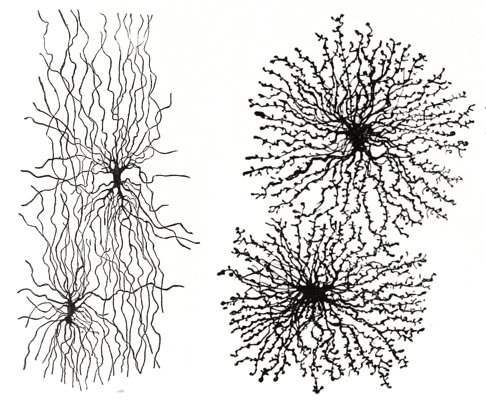

# Neurons And Glia

In this laboratory session, we will study the morphology of the basic cellular constitutents of the nervous system: neurons and glia.

Below, you will be presented with a number of figures and asked to label or color certain structures in each figure.

In Figure \@ref(fig:neuronlabel) label the following structures

1. Dendrites
1. Axon hillock
1. Nodes of Ranvier
1. Myelin sheath
1. Neuronal cell membrane
1. Golgi apparatus
1. Ribosomes
1. Rough endoplasmic reticulum
1. Smooth endoplasmic reticulum
1. Cell nucleus
1. Nucleolus
1. Mitochondrion
1. Microtubules
1. Synapse
1. Synaptic vesicles
1. Synaptic cleft
1. Neurotransmitter receptors
1. Axon terminal

(ref:neuronlab) [Diagram of a myelinated vertebrate motor neuron.](https://commons.wikimedia.org/wiki/File:Complete_neuron_cell_diagram_en.svg)

(\#fig:neuronlabel)(ref:neuronlab)

In Figure \@ref(fig:neurontypelabel) label the following types of neurons

1. Unipolar neurons
1. Bipolar neurons
1. Golgi I neurons: a Purkinje cell, spinal motor neuron and a pyramidal cell
1. Golgi II neuron 

(ref:neurontypelab) Morpholoigcally distinct types of neurons after Cajal. [Histologie du système nerveux de l'homme & des vertébrés, Tome Premier](https://wellcomelibrary.org/item/b2129592x#?c=0&m=0&s=0&cv=14&z=0%2C-3.48%2C1%2C8.6591) (1909) by Santiago Ramón y Cajal translated from Spanish by Dr. L. Azoulay.

(\#fig:neurontypelabel)(ref:neurontypelab)

In Figure \@ref(fig:neurontypelabel) label the following types of glial cells

1. Astrocytes
1. Oligodendrocytes

(ref:glialab) Astrocytes and oligodendrocytes are the major types of macroglia in the grey and white matter of the brain, respectively. [Histologie du système nerveux de l'homme & des vertébrés, Tome Premier](https://wellcomelibrary.org/item/b2129592x#?c=0&m=0&s=0&cv=14&z=0%2C-3.48%2C1%2C8.6591) (1909) by Santiago Ramón y Cajal translated from Spanish by Dr. L. Azoulay.

(\#fig:glialabel)(ref:glialab)

