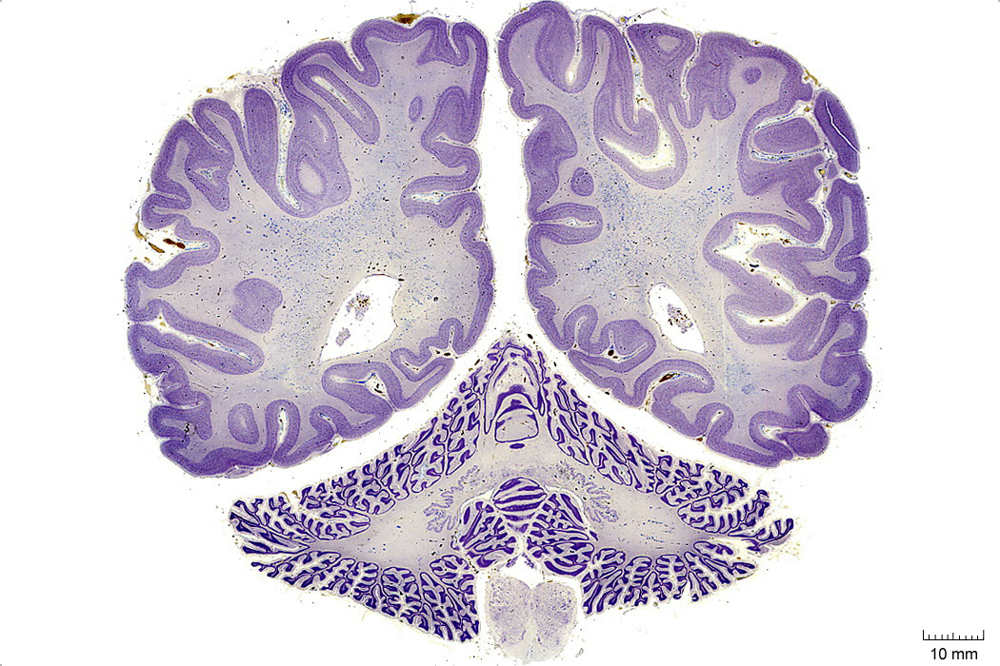

#  The Diencephalon

In this laboratory session, we will study the anatomy of the human diencephalon. Below, you will be presented with a number of figures and asked to label or color certain structures in each figure.

## A Series of Coronal Sections Of A Human Brain 

In Figure \@ref(fig:frogretina), label the following structures:

1. A rod
1. A cone
1. Ahorizontal cell
1. A bipolar cell
1. Various types of amacrine cells
1. A ganglion cell
1. A displaced amacrine cell
1. A pigment epithelial cell with extended process
1. A pigment epithelial cell with retracted process

(ref:c1520) Coronal section from [The Human Brain Atlas](https://msu.edu/~brains/brains/human/index.html) at the [Michigan State University Brain Biodiveristy Bank](https://msu.edu/~brains/copyright.html) which [acknowledges](https://msu.edu/~brains/copyright.html) their support from the National Science Foundation. 

(\#fig:1520)(ref:c1520)

In Figure \@ref(fig:frogretina), label the following structures:

1. A rod
1. A cone
1. Ahorizontal cell
1. A bipolar cell
1. Various types of amacrine cells
1. A ganglion cell
1. A displaced amacrine cell
1. A pigment epithelial cell with extended process
1. A pigment epithelial cell with retracted process

(ref:c1680) Coronal section from [The Human Brain Atlas](https://msu.edu/~brains/brains/human/index.html) at the [Michigan State University Brain Biodiveristy Bank](https://msu.edu/~brains/copyright.html) which [acknowledges](https://msu.edu/~brains/copyright.html) their support from the National Science Foundation. 

(\#fig:1680)(ref:1680)

In Figure \@ref(fig:frogretina), label the following structures:

1. A rod
1. A cone
1. Ahorizontal cell
1. A bipolar cell
1. Various types of amacrine cells
1. A ganglion cell
1. A displaced amacrine cell
1. A pigment epithelial cell with extended process
1. A pigment epithelial cell with retracted process

(ref:c1840) Coronal section from [The Human Brain Atlas](https://msu.edu/~brains/brains/human/index.html) at the [Michigan State University Brain Biodiveristy Bank](https://msu.edu/~brains/copyright.html) which [acknowledges](https://msu.edu/~brains/copyright.html) their support from the National Science Foundation. 

(\#fig:1840)(ref:c1840)

In Figure \@ref(fig:frogretina), label the following structures:

1. A rod
1. A cone
1. Ahorizontal cell
1. A bipolar cell
1. Various types of amacrine cells
1. A ganglion cell
1. A displaced amacrine cell
1. A pigment epithelial cell with extended process
1. A pigment epithelial cell with retracted process

(ref:c2000) Coronal section from [The Human Brain Atlas](https://msu.edu/~brains/brains/human/index.html) at the [Michigan State University Brain Biodiveristy Bank](https://msu.edu/~brains/copyright.html) which [acknowledges](https://msu.edu/~brains/copyright.html) their support from the National Science Foundation. 

(\#fig:2000)(ref:c2000)

In Figure \@ref(fig:frogretina), label the following structures:

1. A rod
1. A cone
1. Ahorizontal cell
1. A bipolar cell
1. Various types of amacrine cells
1. A ganglion cell
1. A displaced amacrine cell
1. A pigment epithelial cell with extended process
1. A pigment epithelial cell with retracted process

(ref:c2060) Coronal section from [The Human Brain Atlas](https://msu.edu/~brains/brains/human/index.html) at the [Michigan State University Brain Biodiveristy Bank](https://msu.edu/~brains/copyright.html) which [acknowledges](https://msu.edu/~brains/copyright.html) their support from the National Science Foundation. 

(\#fig:2060)(ref:c2060)

In Figure \@ref(fig:frogretina), label the following structures:

1. A rod
1. A cone
1. Ahorizontal cell
1. A bipolar cell
1. Various types of amacrine cells
1. A ganglion cell
1. A displaced amacrine cell
1. A pigment epithelial cell with extended process
1. A pigment epithelial cell with retracted process

(ref:c2240) Coronal section from [The Human Brain Atlas](https://msu.edu/~brains/brains/human/index.html) at the [Michigan State University Brain Biodiveristy Bank](https://msu.edu/~brains/copyright.html) which [acknowledges](https://msu.edu/~brains/copyright.html) their support from the National Science Foundation. 

(\#fig:2240)(ref:c2240)

In Figure \@ref(fig:frogretina), label the following structures:

1. A rod
1. A cone
1. Ahorizontal cell
1. A bipolar cell
1. Various types of amacrine cells
1. A ganglion cell
1. A displaced amacrine cell
1. A pigment epithelial cell with extended process
1. A pigment epithelial cell with retracted process

(ref:c2390) Coronal section from [The Human Brain Atlas](https://msu.edu/~brains/brains/human/index.html) at the [Michigan State University Brain Biodiveristy Bank](https://msu.edu/~brains/copyright.html) which [acknowledges](https://msu.edu/~brains/copyright.html) their support from the National Science Foundation. 

(\#fig:2390)(ref:2390)

In Figure \@ref(fig:frogretina), label the following structures:

1. A rod
1. A cone
1. Ahorizontal cell
1. A bipolar cell
1. Various types of amacrine cells
1. A ganglion cell
1. A displaced amacrine cell
1. A pigment epithelial cell with extended process
1. A pigment epithelial cell with retracted process

(ref:c2500) Coronal section from [The Human Brain Atlas](https://msu.edu/~brains/brains/human/index.html) at the [Michigan State University Brain Biodiveristy Bank](https://msu.edu/~brains/copyright.html) which [acknowledges](https://msu.edu/~brains/copyright.html) their support from the National Science Foundation. 

(\#fig:2500)(ref:c2500)

In Figure \@ref(fig:frogretina), label the following structures:

1. A rod
1. A cone
1. Ahorizontal cell
1. A bipolar cell
1. Various types of amacrine cells
1. A ganglion cell
1. A displaced amacrine cell
1. A pigment epithelial cell with extended process
1. A pigment epithelial cell with retracted process

(ref:c2660) Coronal section from [The Human Brain Atlas](https://msu.edu/~brains/brains/human/index.html) at the [Michigan State University Brain Biodiveristy Bank](https://msu.edu/~brains/copyright.html) which [acknowledges](https://msu.edu/~brains/copyright.html) their support from the National Science Foundation. 

(\#fig:2660)(ref:c2660)

In Figure \@ref(fig:frogretina), label the following structures:

1. A rod
1. A cone
1. Ahorizontal cell
1. A bipolar cell
1. Various types of amacrine cells
1. A ganglion cell
1. A displaced amacrine cell
1. A pigment epithelial cell with extended process
1. A pigment epithelial cell with retracted process

(ref:c2800) Coronal section from [The Human Brain Atlas](https://msu.edu/~brains/brains/human/index.html) at the [Michigan State University Brain Biodiveristy Bank](https://msu.edu/~brains/copyright.html) which [acknowledges](https://msu.edu/~brains/copyright.html) their support from the National Science Foundation. 

(\#fig:2800)(ref:c2800)

In Figure \@ref(fig:frogretina), label the following structures:

1. A rod
1. A cone
1. Ahorizontal cell
1. A bipolar cell
1. Various types of amacrine cells
1. A ganglion cell
1. A displaced amacrine cell
1. A pigment epithelial cell with extended process
1. A pigment epithelial cell with retracted process

(ref:c3270) Coronal section from [The Human Brain Atlas](https://msu.edu/~brains/brains/human/index.html) at the [Michigan State University Brain Biodiveristy Bank](https://msu.edu/~brains/copyright.html) which [acknowledges](https://msu.edu/~brains/copyright.html) their support from the National Science Foundation. 

(\#fig:3270)(ref:c3270)

##  A Series Of Sagittal Sections Of A Human Brain  

In Figure \@ref(fig:frogretina), label the following structures:

1. A rod
1. A cone
1. Ahorizontal cell
1. A bipolar cell
1. Various types of amacrine cells
1. A ganglion cell
1. A displaced amacrine cell
1. A pigment epithelial cell with extended process
1. A pigment epithelial cell with retracted process

(ref:hbd) A dorsal view of a human brain. 

(\#fig:hbdorsa)(ref:hbd)

In Figure \@ref(fig:frogretina), label the following structures:

1. A rod
1. A cone
1. Ahorizontal cell
1. A bipolar cell
1. Various types of amacrine cells
1. A ganglion cell
1. A displaced amacrine cell
1. A pigment epithelial cell with extended process
1. A pigment epithelial cell with retracted process

(ref:hbd) A dorsal view of a human brain. 

(\#fig:hbdorl)(ref:hbd)

