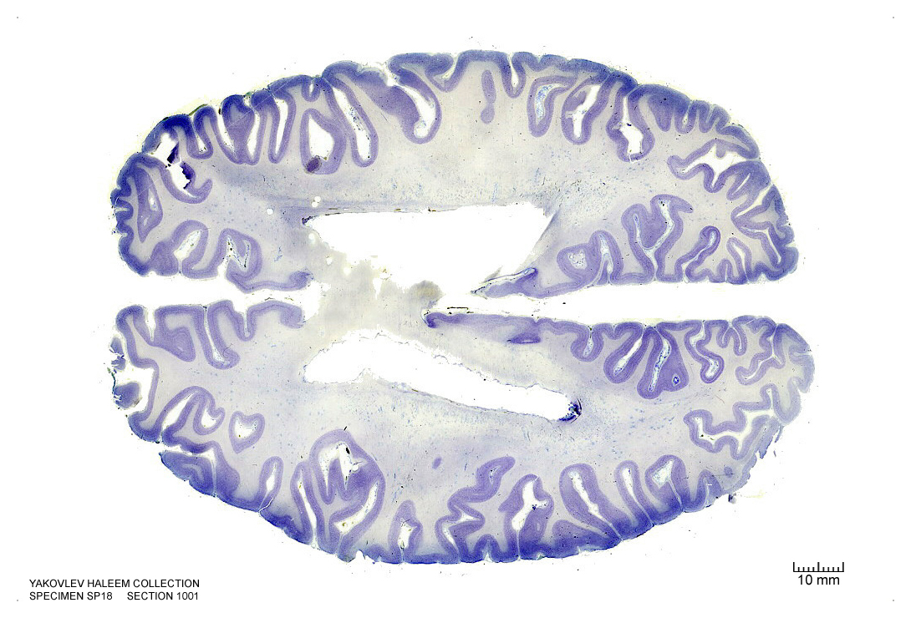
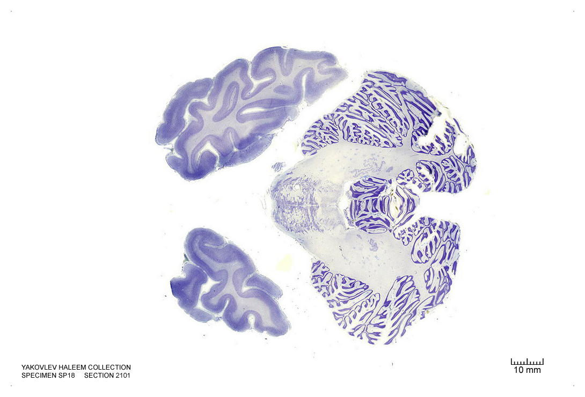
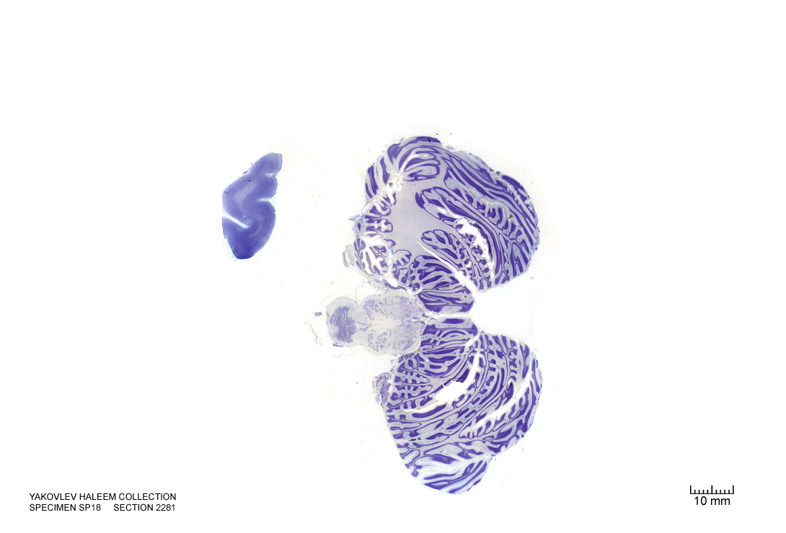
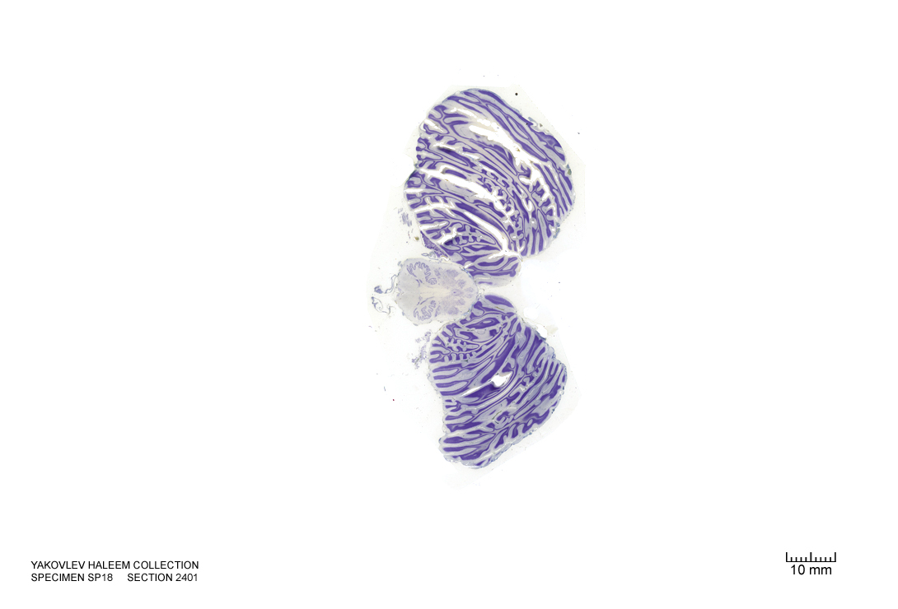

#  The Metencephalon

In this laboratory session, we will study the anatomy of the human metencephalon. The metencephalon is the embryonic part of the hindbrain that differentiates into the pons and the cerebellum. It contains a portion of the fourth ventricle and the trigeminal nerve (CN V), abducens nerve (CN VI), facial nerve (CN VII), and a portion of the vestibulocochlear nerve (CN VIII).

Below, you will be presented with a number of figures and asked to label or color certain structures in each figure.       

## A Series Of Coronal Sections Of A Human Brain 

In Figure \@ref(fig:2390), label the following structures:

1. The cingulate gyrus
1. The corpus callosum
1. The fornix 
1. The lateral ventricle
1. The choroid plexus
1. The caudate nucleus
1. The thalamus
1. The insula
1. The lateral sulcus
1. The superior temporal gyrus
1. The superior temporal sulcus
1. The middle temporal gyrus
1. The middle temporal sulcus
1. The inferior temporal gyrus
1. The inferior temporal sulcus
1. The putamen
1. The hippocampus
1. The dentate gyrus
1. The pineal gland
1. The periaqueductal grey matter
1. The superior cerebellar peduncle
1. The cerebral aqueduct
1. The pulvinar
1. The superior colliculus
1. The lateral ventricle
1. The oculomotor nucleus
1. The medial longitudinal fasciculus
1. The parahippocampal gyrus
1. The cerebellum
1. The pons
1. The pyramidal tract

(\#fig:2390)(ref:c2390)

In Figure \@ref(fig:2500), label the following structures:

1. The cingulate gyrus
1. The corpus callosum
1. The fornix 
1. The choroid plexus
1. The caudate nucleus
1. The insula
1. The lateral sulcus
1. The middle temporal gyrus
1. The middle temporal sulcus
1. The inferior temporal gyrus
1. The inferior temporal sulcus
1. The hippocampus
1. The dentate gyrus
1. The superior cerebellar peduncle
1. The inferior olive
1. The 4^th^ ventricle
1. The lateral ventricle
1. The inferior colliculus
1. The parahippocampal gyrus
1. The medial longitudinal fasciculus
1. The cerebellum
1. The middle cerebellar peduncle
1. The pontine reticular formation

(\#fig:2500)(ref:c2500)

In Figure \@ref(fig:2660), label the following structures:

1. The dentate gyrus
1. The medial vestibular nucleus
1. The nucleus of the solitary tract
1. The solitary tract
1. The lateral ventricle
1. The 4^th^ ventricle
1. The inferior cerebellar peduncle
1. The inferior olive

(\#fig:2660)(ref:c2660)

In Figure \@ref(fig:2800), label the following structures:

1. The lateral ventricle
1. The vermis
1. The cerebellum
1. The inferior olive
1. The spinal cord

(ref:c2800) Coronal section from [The Human Brain Atlas](https://msu.edu/~brains/brains/human/index.html) at the [Michigan State University Brain Biodiveristy Bank](https://msu.edu/~brains/copyright.html) which [acknowledges](https://msu.edu/~brains/copyright.html) their support from the National Science Foundation. 

(\#fig:2800)(ref:c2800)

In Figure \@ref(fig:3270), label the following structures:

1. The calcarine sulcus
1. The striate cortex (primary visual cortex)
1. The vermis
1. The cerebellum
1. The spinal cord:
   * dorsal horn
   * ventral horn
   * dorsal column
   * lateral column
   * ventral column

(\#fig:3270)(ref:c3270)

##  A Series Of Sagittal Sections Of A Human Brain  

In Figure \@ref(fig:1492), label the following structures:

1. The cingulate sulcus
1. The cingulate gyrus
1. The corpus callosum
1. The lateral ventricle
1. The caudate nucleus
1. The insula
1. The lateral sulcus
1. The superior temporal gyrus
1. The superior temporal sulcus
1. The middle temporal gyrus
1. The middle temporal sulcus
1. The inferior temporal gyrus
1. The inferior temporal sulcus
1. The putamen
1. The nucleus accumbens
1. The optic nerves (left and right)
1. The septum pelucidum
1. The septal nuclei
1. The internal capsule
1. The external capsule
1. The entorhinal cortex
1. The parahippocampal gyrus

(\#fig:1492)(ref:s1492)

In Figure \@ref(fig:1392), label the following structures:

(\#fig:1392)(ref:s1392)

In Figure \@ref(fig:1232), label the following structures:

(\#fig:1232)(ref:s1232)

In Figure \@ref(fig:1022), label the following structures:

(\#fig:1022)(ref:s1022)

In Figure \@ref(fig:902), label the following structures:

(\#fig:902)(ref:s902)

In Figure \@ref(fig:842), label the following structures:

(\#fig:842)(ref:s842)

In Figure \@ref(fig:782), label the following structures:

(\#fig:782)(ref:s782)

In Figure \@ref(fig:722), label the following structures:

(\#fig:722)(ref:s722)

In Figure \@ref(fig:572), label the following structures:

(\#fig:572)(ref:s572)

In Figure \@ref(fig:512), label the following structures:

(\#fig:512)(ref:s512)

In Figure \@ref(fig:452), label the following structures:

(\#fig:452)(ref:s452)

In Figure \@ref(fig:392), label the following structures:

(\#fig:392)(ref:s392)

In Figure \@ref(fig:332), label the following structures:

(\#fig:332)(ref:s332)

In Figure \@ref(fig:302), label the following structures:

(\#fig:302)(ref:s302)

In Figure \@ref(fig:272), label the following structures:

(\#fig:272)(ref:s272)

In Figure \@ref(fig:242), label the following structures:

(\#fig:242)(ref:s242)

In Figure \@ref(fig:212), label the following structures:

(\#fig:212)(ref:s212)

In Figure \@ref(fig:182), label the following structures:

(\#fig:182)(ref:s182)

##  A Series Of Horizontal Sections Of A Human Brain  

In Figure \@ref(fig:800), label the following structures:

(\#fig:800)(ref:h800)

In Figure \@ref(fig:940), label the following structures:

(\#fig:940)(ref:h940)

In Figure \@ref(fig:1000), label the following structures:

(\#fig:1000)(ref:h1000)

In Figure \@ref(fig:1100), label the following structures:

(\#fig:1100)(ref:h11100)

In Figure \@ref(fig:1200), label the following structures:

(\#fig:1200)(ref:h1200)

In Figure \@ref(fig:1300), label the following structures:

(\#fig:1300)(ref:h1300)

In Figure \@ref(fig:1400), label the following structures:

(\#fig:1400)(ref:h1400)

In Figure \@ref(fig:1500), label the following structures:

(\#fig:1500)(ref:h1500)

In Figure \@ref(fig:1600), label the following structures:

(\#fig:1600)(ref:h1600)

In Figure \@ref(fig:1640), label the following structures:

(\#fig:1640)(ref:h1640)

In Figure \@ref(fig:1700), label the following structures:

(\#fig:1700)(ref:h1700)

In Figure \@ref(fig:1740), label the following structures:

(\#fig:1740)(ref:h1740)

In Figure \@ref(fig:1800), label the following structures:

(\#fig:1800)(ref:h1800)

In Figure \@ref(fig:ho1840), label the following structures:

(\#fig:ho1840)(ref:h1840)

In Figure \@ref(fig:1900), label the following structures:

(\#fig:1900)(ref:h1900)

In Figure \@ref(fig:ho2000), label the following structures:

(\#fig:ho2000)(ref:h2000)

In Figure \@ref(fig:2100), label the following structures:

(\#fig:2100)(ref:h2100)

In Figure \@ref(fig:2200), label the following structures:

(\#fig:2200)(ref:h2200)

In Figure \@ref(fig:ho2240), label the following structures:

(\#fig:ho2240)(ref:h2240)

In Figure \@ref(fig:2260), label the following structures:

(\#fig:2260)(ref:h2260)

In Figure \@ref(fig:2280), label the following structures:

(\#fig:2280)(ref:h2280)

In Figure \@ref(fig:2300), label the following structures:

(\#fig:2300)(ref:h2300)

In Figure \@ref(fig:2340), label the following structures:

(\#fig:2340)(ref:h2340)

In Figure \@ref(fig:2400), label the following structures:

(\#fig:2400)(ref:h2400)

In Figure \@ref(fig:2440), label the following structures:

(\#fig:2440)(ref:h2440)

In Figure \@ref(fig:2480), label the following structures:

(\#fig:2480)(ref:h2480)

