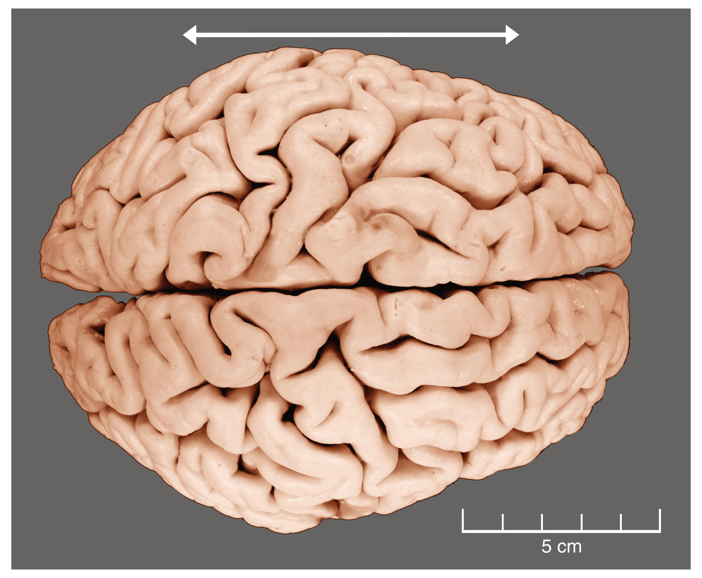
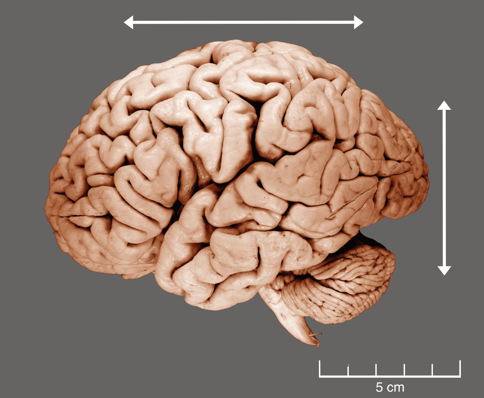
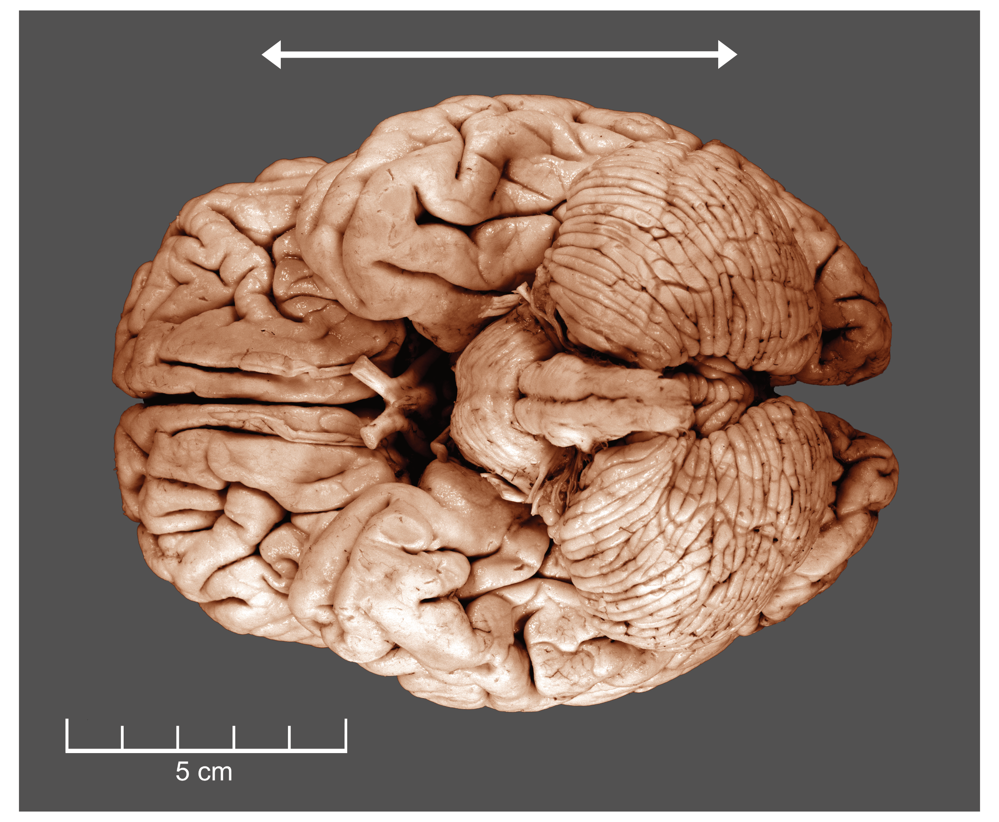
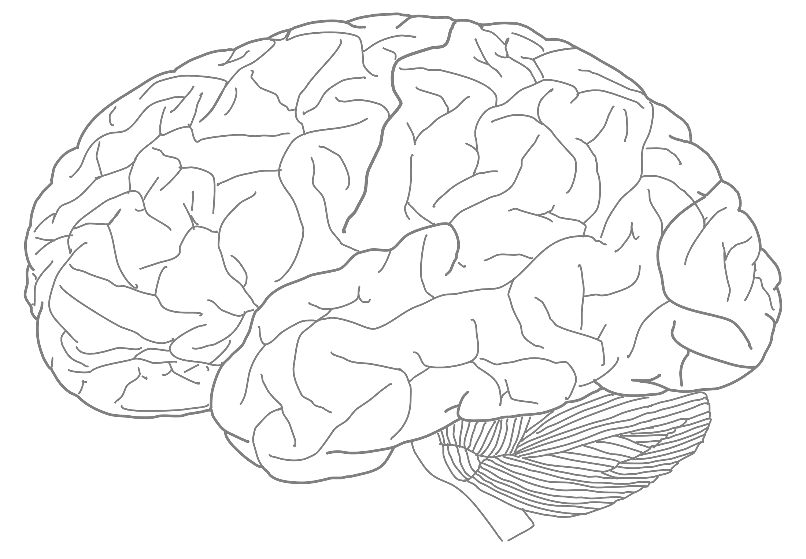
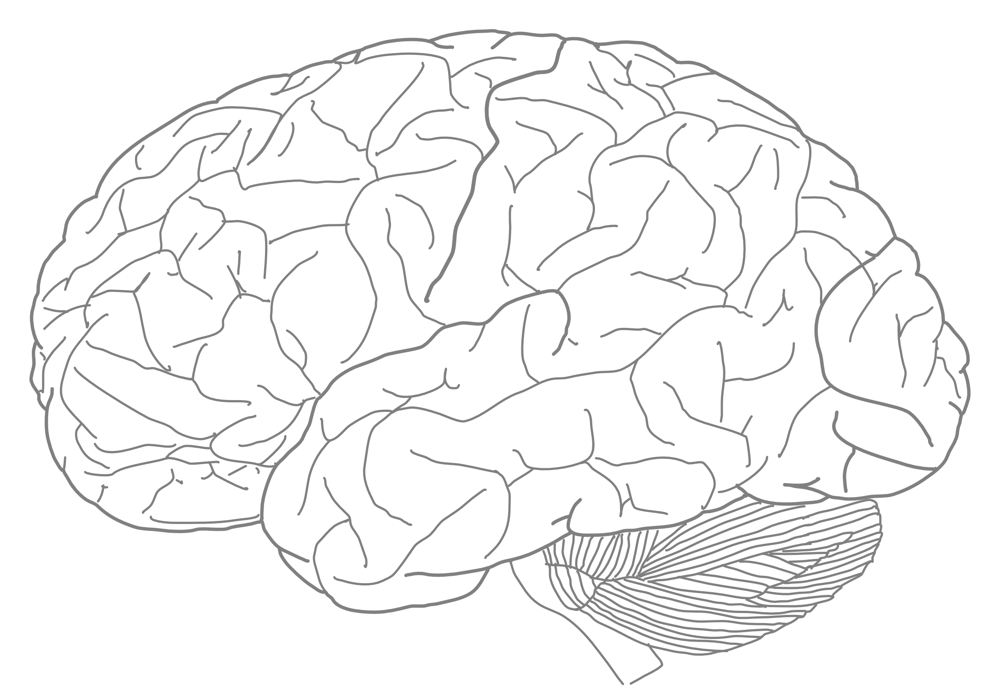
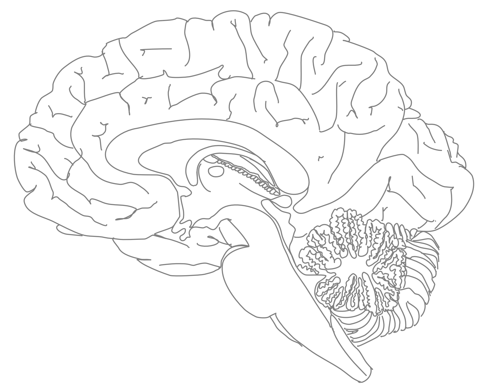
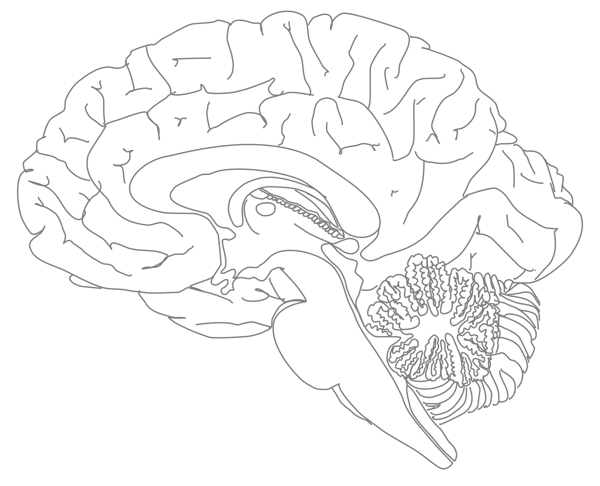

# Surface Anatomy Of The Brain

In this laboratory session, we will study the surface anatomy of the human brain. Below, you will be presented with a number of figures and asked to label or color certain structures in each figure.

## A dorsal view of a human brain. 

1. Write “LH“ over the left hemisphere and “RH“ over the right
hemisphere in figure 1 below.
1. Write “ANTERIOR’ and “POSTERIOR“ next to the arrowhead pointing
in the corresponding direction: 

1. Mark the longitudinal cerebral fissure with a sequence of “x”’s


(ref:hbd) A dorsal view of a human brain. 

(\#fig:hbdorsal)(ref:hbd)

##  A dorso-lateral view of a human brain.  

1. Write “ANTERIOR’ and “POSTERIOR“ next to the arrowhead pointing
in the corresponding direction 

1. Trace the Sylvian fissure using a black marker
1. Trace the central sulcus from the midline to the Sylvian fissure using a black marker

(ref:hbdl) A dorso-lateral view of a human brain. 

(\#fig:hbdl)(ref:hbdl)

## A lateral view of a human brain.

1. Write “ANTERIOR’ and “POSTERIOR“ next to the arrowhead pointing
in the corresponding direction 

1. Write “DORSAL“ and “VENTRAL“ next to the arrowhead pointing
in the corresponding direction 

1. Write “CEREBRUM“ and “CEREBELLUM“ next to the corresponding structures
1. rite “BRAINSTEM“ next to the corresponding structure

1. Write “OLFACTORY BULB“ next to the corresponding structure


(ref:hbl) A lateral view of a human brain. 

(\#fig:hbl)(ref:hbl)

## A ventral view of a human brain. 

1. Write “LH“ over the left hemisphere and “RH‘ over the right
hemisphere in figure 1 below.
1. Write “LCblH“ over the left hemisphere of the cerebellum
and “RCblH‘ over the right cerebellar hemisphere in the figure below.
1. Write “Pons“ over the corresponding structure in the figure below.
1. Write “MO“ denoting the medulla oblongata over the corresponding
structure in the figure below.
1. Write “ANTERIOR’ and “POSTERIOR“ next to the arrowhead pointing
in the corresponding direction.


(ref:hbv) A ventral view of a human brain. 

(\#fig:hbv)(ref:hbv)

## A lateral view of the human brain.

1. Color the frontal lobe red
2. Color the temporal lobe green
3. Color the parietal lobe yellow
4. Color the occipital lobe blue
5. Mark the central sulcus with a sequence of  “o“’s
6. Mark the Sylvian fissure with a sequence of “x”’s
 

(ref:bll) A lateral view of the major lobes of the human brain.

(\#fig:bfll)(ref:bll)

1. Mark the central sulcus with a sequence of  “o“’s.
1. Mark the Sylvian fissure with a sequence of “x”’s.
1. Color the precentral gyrus red.
1. Color the postcentral gyrus green.
1. Color the superior temporal gyrus blue.


(ref:blg) A lateral view of the major gyri of the human brain.

(\#fig:bflg)(ref:blg)

## A medial view of the human brain.

1. Color the septum pellucidum yellow
1. Color the thalamus blue
5. Color the hypothalamus grey
6. Color the pons red
7. Color the medulla oblongata  green
8. Color the tectum yellow
9. Color the tegmentum  grey
10. Color the pineal body  red


(ref:blmi) A medial view of the human brain.

(\#fig:bflm)(ref:blmi)

1. Color the cingulate gyrus green
2. Color the corpus callosum red
3. Color the fornix yellow
4. Color the olfactory bulb blue
5. Color the optic chiasm grey


(ref:blmii) A medial view of a human brain. 

(\#fig:bflmii)(ref:blmii)

1. Color the third ventricle green
2. Color the aqueduct red
3. Color the fourth ventricle blue
4. Color the spinal call yellow


(ref:blmii) A medial view of a human brain. 

(\#fig:bflmiii)(ref:blmiii)

## Cytoarchitectonic areas according to Brodmann

1. Label the highlighted Brodamann areas with the corresponding numbers and names.

(ref:bl) A lateral view of the cytoarchitectonic areas of the human brain according to Brodmann. 

(\#fig:brodl)(ref:bl)

1. Label the highlighted Brodamann areas with the corresponding numbers and names

(ref:bm) A medial view of the cytoarchitectonic areas of the human brain according to Brodmann

(\#fig:brodm)(ref:bm)

