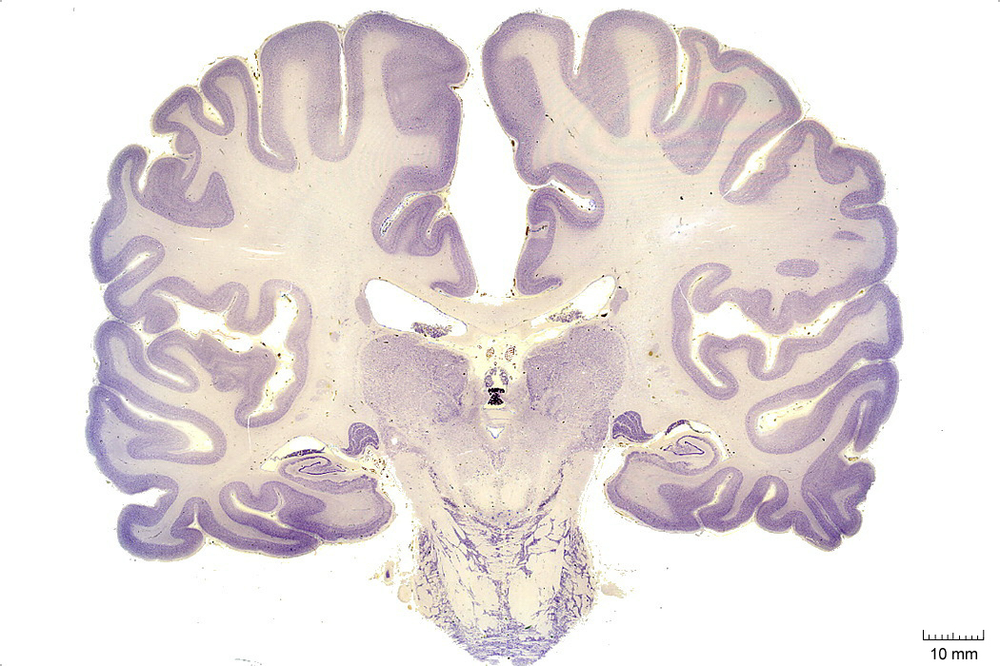
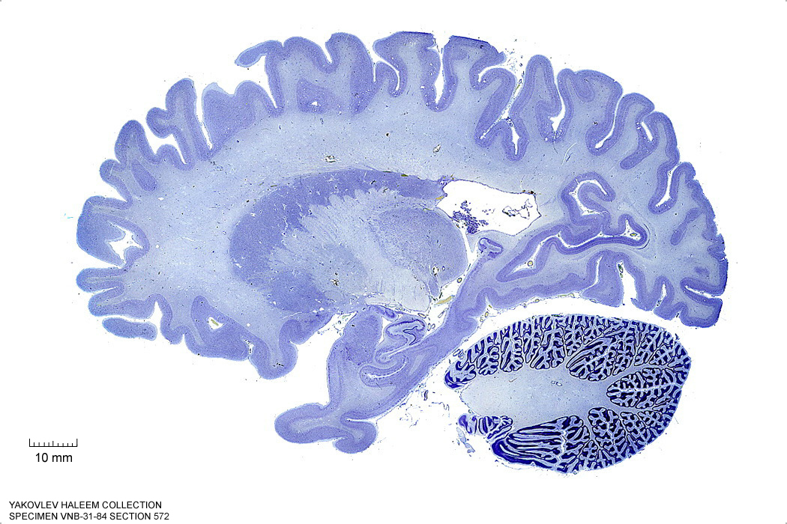
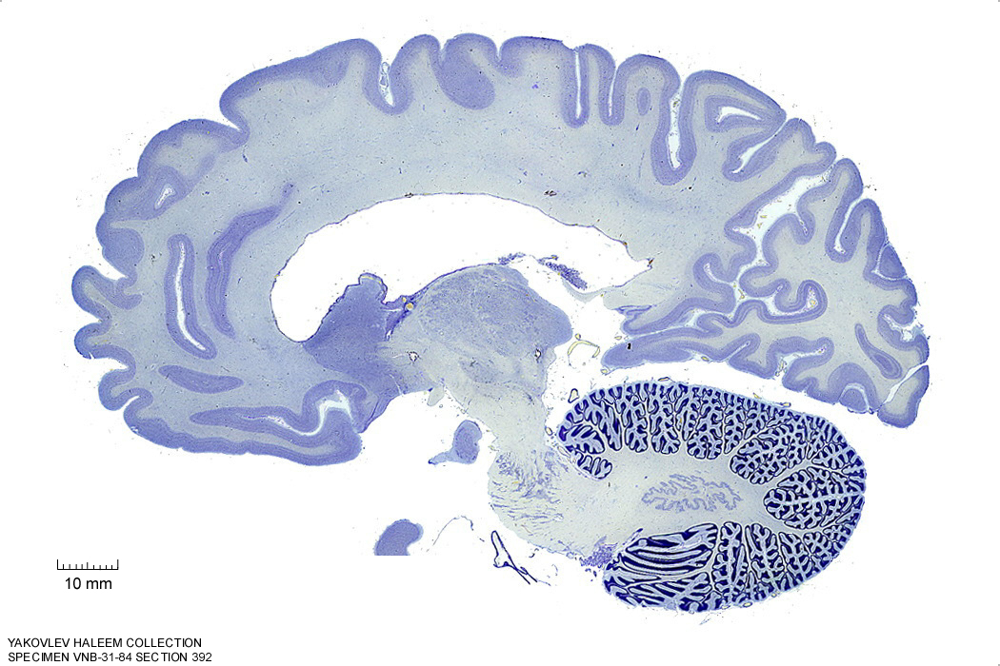
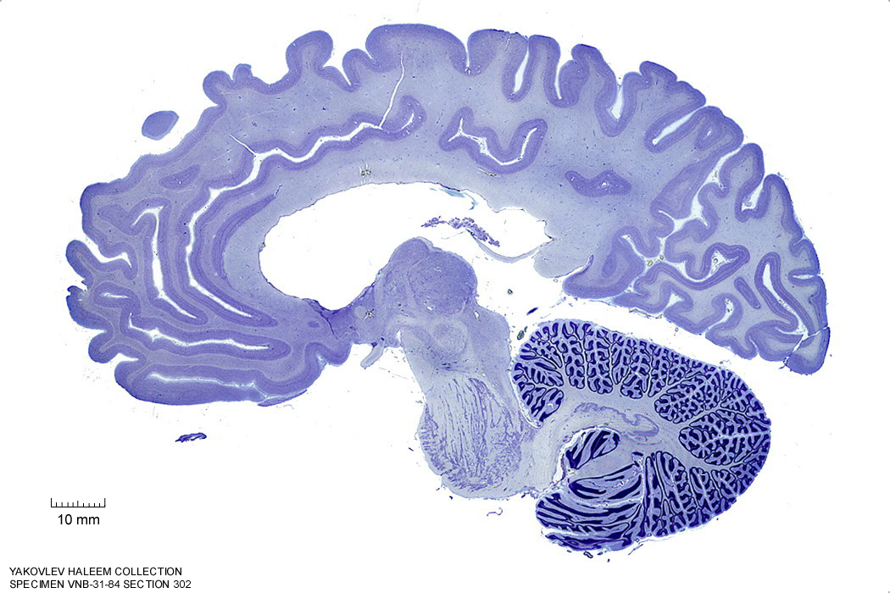
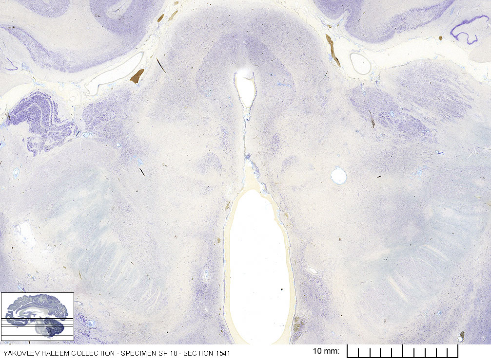

#  The Mesencephalon

In this laboratory session, we will study the anatomy of the human mesencephalon. The midbrain or mesencephalon is the forward-most portion of the brainstem and is associated with vision, hearing, motor control, sleep and wakefulness, arousal (alertness), and temperature regulation. The name come from the Greek mesos, "middle", and enkephalos, "brain") The principal regions of the midbrain are the tectum, the cerebral aqueduct, tegmentum, and the cerebral peduncles. Rostrally the midbrain adjoins the diencephalon (thalamus, hypothalamus, etc.), while caudally it adjoins the hindbrain (pons, medulla and cerebellum). In the rostral direction, the midbrain noticeably splays laterally.

Below, you will be presented with a number of figures and asked to label or color certain structures in each figure.

## A Series Of Coronal Sections Of A Human Brain 

In Figure \@ref(fig:2240), label the following structures:

1. The cerebral aqueduct
1. The pons

```{r 2240, fig.cap='(ref:c2240)', echo=FALSE, message=FALSE, warning=FALSE}

```

In Figure \@ref(fig:2390), label the following structures:

1. The periaqueductal grey matter
1. The superior colliculus
1. The lateral ventricle
1. The oculomotor nucleus
1. The pons


```{r 2390, fig.cap='(ref:c2390)', echo=FALSE, message=FALSE, warning=FALSE}
knitr::include_graphics("./figures/cns/2390_cell.jpg")
```

In Figure \@ref(fig:2500), label the following structures:

1. The inferior colliculus
1. The medial longitudinal fasciculus
1. The pontine reticular formation

##  A Series Of Sagittal Sections Of A Human Brain  

In Figure \@ref(fig:572), label the following structures:

1. The cerebral peduncle
1. The brachium of the superior colliculus

```{r 572, fig.cap='(ref:s572)', echo=FALSE, message=FALSE, warning=FALSE}

```


In Figure \@ref(fig:512), label the following structures:

1. The cerebral peduncle
1. The middle cerebellar peduncle
1. The brachium of the superior colliculus


```{r 512, fig.cap='(ref:s512)', echo=FALSE, message=FALSE, warning=FALSE}
knitr::include_graphics("./figures/cns/0512_cell.jpg")
```


In Figure \@ref(fig:452), label the following structures:

1. The substantia nigra
1. The cerebral peduncle


```{r 452, fig.cap='(ref:s452)', echo=FALSE, message=FALSE, warning=FALSE}
knitr::include_graphics("./figures/cns/0452_cell.jpg")
```


In Figure \@ref(fig:392), label the following structures:

1. The brachium of the superior colliculus
1. The brachium of the inferior colliculus


```{r 392, fig.cap='(ref:s392)', echo=FALSE, message=FALSE, warning=FALSE}

```


In Figure \@ref(fig:332), label the following structures:

1. The red nucleus
1. The substantia nigra
1. The cerebral peduncle
1. The superior colliculus


```{r 332, fig.cap='(ref:s332)', echo=FALSE, message=FALSE, warning=FALSE}
knitr::include_graphics("./figures/cns/0332_cell.jpg")
```


In Figure \@ref(fig:302), label the following structures:

1. The red nucleus
1. The substantia nigra
1. The cerebral peduncle
1. The superior colliculus
1. The inferior colliculus


```{r 302, fig.cap='(ref:s302)', echo=FALSE, message=FALSE, warning=FALSE}

```


In Figure \@ref(fig:272), label the following structures:

1. The red nucleus
1. The substantia nigra
1. The cerebral peduncle
1. The superior colliculus
1. The inferior colliculus


```{r 272, fig.cap='(ref:s272)', echo=FALSE, message=FALSE, warning=FALSE}
knitr::include_graphics("./figures/cns/0272_cell.jpg")
```


In Figure \@ref(fig:242), label the following structures:

1. The red nucleus
1. The substantia nigra
1. The cerebral peduncle
1. The superior colliculus
1. The inferior colliculus


```{r 242, fig.cap='(ref:s242)', echo=FALSE, message=FALSE, warning=FALSE}
knitr::include_graphics("./figures/cns/0242_cell.jpg")
```


In Figure \@ref(fig:212), label the following structures:

1. The red nucleus
1. The cerebral peduncle
1. The superior colliculus
1. The inferior colliculus


```{r 212, fig.cap='(ref:s212)', echo=FALSE, message=FALSE, warning=FALSE}
knitr::include_graphics("./figures/cns/0212_cell.jpg")
```


In Figure \@ref(fig:182), label the following structures:

1. The red nucleus
1. The cerebral peduncle
1. The superior colliculus
1. The inferior colliculus


```{r 182, fig.cap='(ref:s182)', echo=FALSE, message=FALSE, warning=FALSE}
knitr::include_graphics("./figures/cns/0182_cell.jpg")
```

In Figure \@ref(fig:152), label the following structures:

1. The red nucleus
1. The cerebral peduncle
1. The superior colliculus
1. The inferior colliculus


```{r 152, fig.cap='(ref:s152)', echo=FALSE, message=FALSE, warning=FALSE}
knitr::include_graphics("./figures/cns/0182_cell.jpg")
```

##  A Series Of Horizontal Sections Of A Human Brain  

In Figure \@ref(fig:1600), label the following structures:

1. The cerebral aqueduct
1. The mammillothalamic tract
1. The red nucleus
1. The choroid plexus
1. The cerebral peduncle
1. The inferior colliculus


```{r 1600, fig.cap='(ref:h1600)', echo=FALSE, message=FALSE, warning=FALSE}
knitr::include_graphics("./figures/cns/horizontal/1600_cell.jpg")
```

In Figure \@ref(fig:1640), label the following structures:

1. The cerebral aqueduct
1. The red nucleus
1. The choroid plexus
1. The cerebral peduncle
1. The dorsal raphe nucleus
1. The periaqueductal grey area
1. The inferior colliculus


```{r 1640, fig.cap='(ref:h1640)', echo=FALSE, message=FALSE, warning=FALSE}
knitr::include_graphics("./figures/cns/horizontal/1640_cell.jpg")
```

In Figure \@ref(fig:1700), label the following structures:

1. The cerebral aqueduct
1. The red nucleus
1. The cerebral peduncle
1. The dorsal raphe nucleus
1. The periaqueductal grey area
1. The inferior colliculus


```{r 1700, fig.cap='(ref:h1700)', echo=FALSE, message=FALSE, warning=FALSE}
knitr::include_graphics("./figures/cns/horizontal/1700_cell.jpg")
```

In Figure \@ref(fig:1740), label the following structures:

1. The cerebral aqueduct
1. The cerebral peduncle
1. The dorsal raphe nucleus
1. The periaqueductal grey area
1. The raphe nucleus


```{r 1740, fig.cap='(ref:h1740)', echo=FALSE, message=FALSE, warning=FALSE}
knitr::include_graphics("./figures/cns/horizontal/1740_cell.jpg")
```

In Figure \@ref(fig:1541), label the following structures:

1. The 3^d^ ventricle
1. The medial geniculate body
1. The lateral geniculate body
1. The cerebral aqueduct
1. The periaqueductal gray
1. The red nucleus
1. The medial lemniscus
1. The internal capsule
1. The subthalamic nucleus
1. The corticospinal fibers
1. The corticopontine fibers
1. The spinothalamic tract
1. The superior colliculus

(ref:bs1541) Horizontal section from [The Human Brain Atlas](https://msu.edu/~brains/brains/human/index.html) at the [Michigan State University Brain Biodiveristy Bank](https://msu.edu/~brains/copyright.html) which [acknowledges](https://msu.edu/~brains/copyright.html) their support from the National Science Foundation. 

```{r 1541, fig.cap='(ref:bs1541)', echo=FALSE, message=FALSE, warning=FALSE}

```


In Figure \@ref(fig:1641), label the following structures:

1. The medial geniculate body
1. The lateral geniculate body
1. The cerebral aqueduct
1. The periaqueductal gray
1. The red nucleus
1. The medial lemniscus
1. The internal capsule
1. The subthalamic nucleus
1. The corticospinal fibers
1. The corticopontine fibers
1. The corticobulbar fibers
1. The nucleus of cranial nerve IV (trochlear)
1. The spinothalamic tract
1. The inferior colliculus
1. The substantia nigra
1. The 3^d^ ventricle
1. The optic tract
1. The interpeduncular fossa
1. The mammillary body

(ref:bs1641) Horizontal section from [The Human Brain Atlas](https://msu.edu/~brains/brains/human/index.html) at the [Michigan State University Brain Biodiveristy Bank](https://msu.edu/~brains/copyright.html) which [acknowledges](https://msu.edu/~brains/copyright.html) their support from the National Science Foundation. 

```{r 1641, fig.cap='(ref:bs1641)', echo=FALSE, message=FALSE, warning=FALSE}
knitr::include_graphics("./figures/cns/brainstem/1640_cell_unlabelled.jpg")
```


