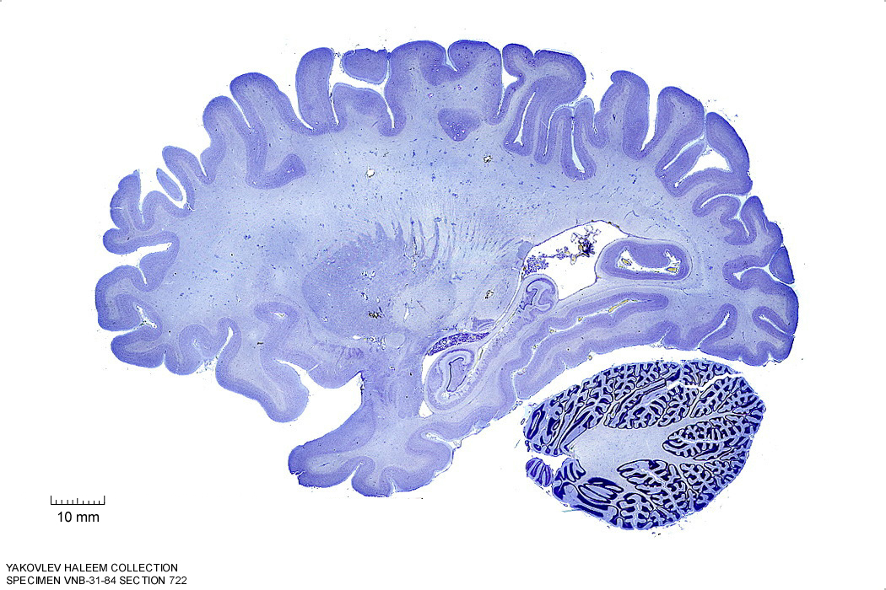
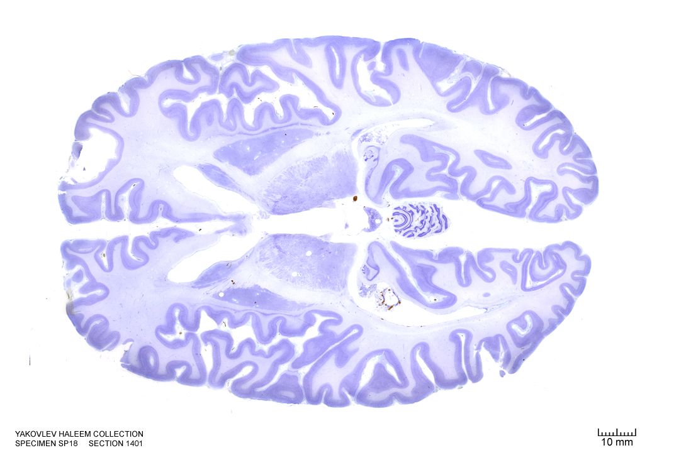
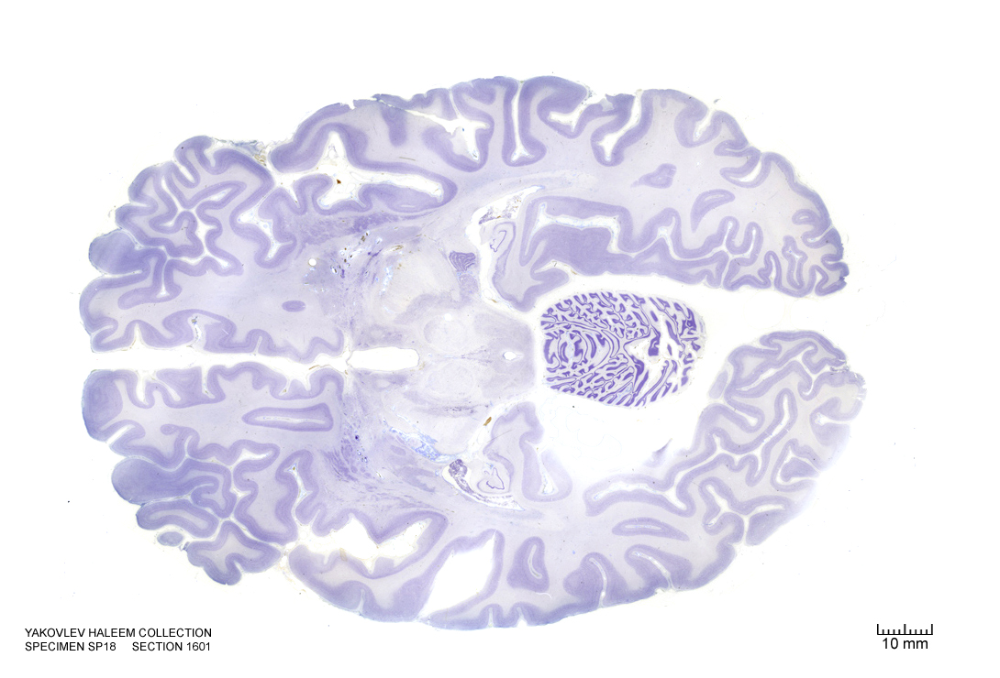
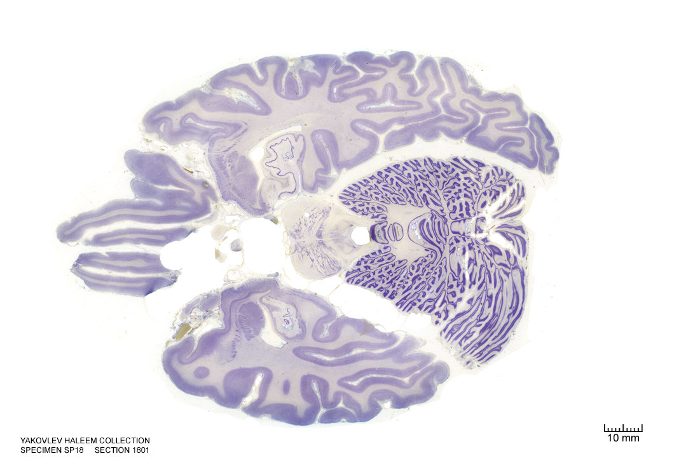
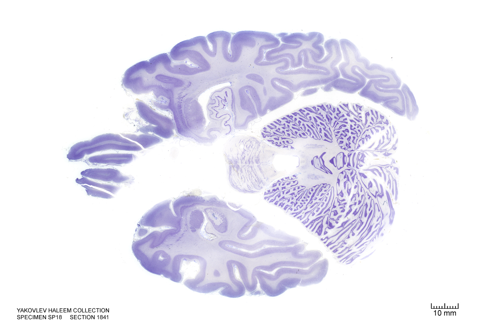
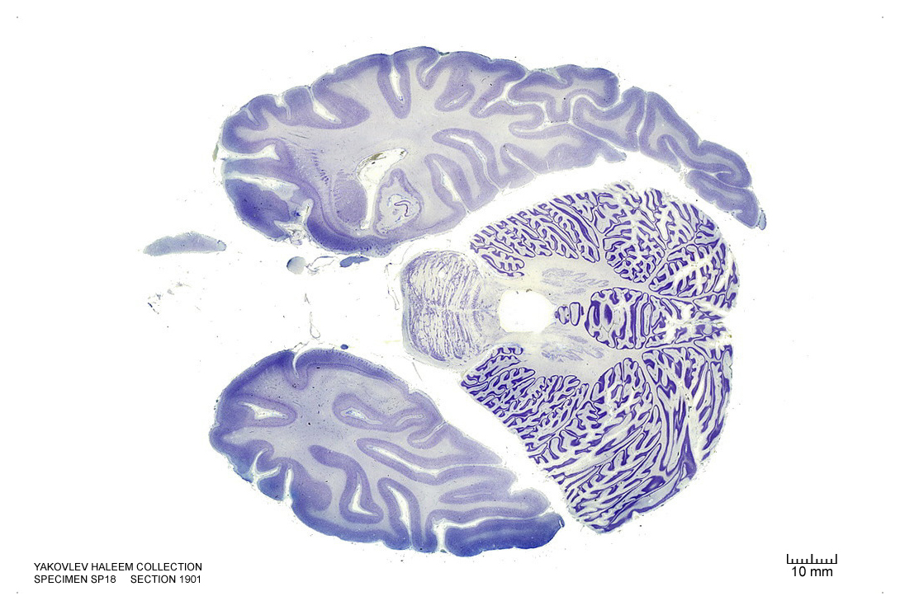
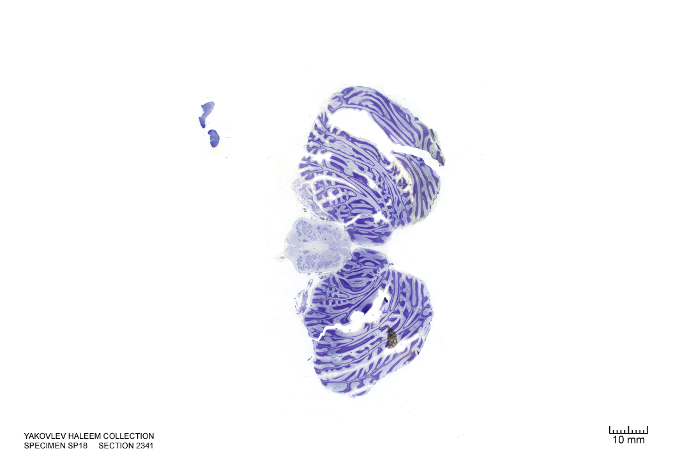
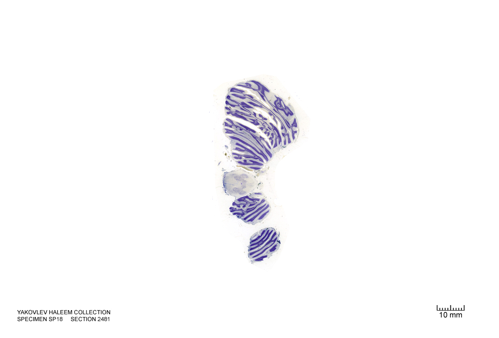
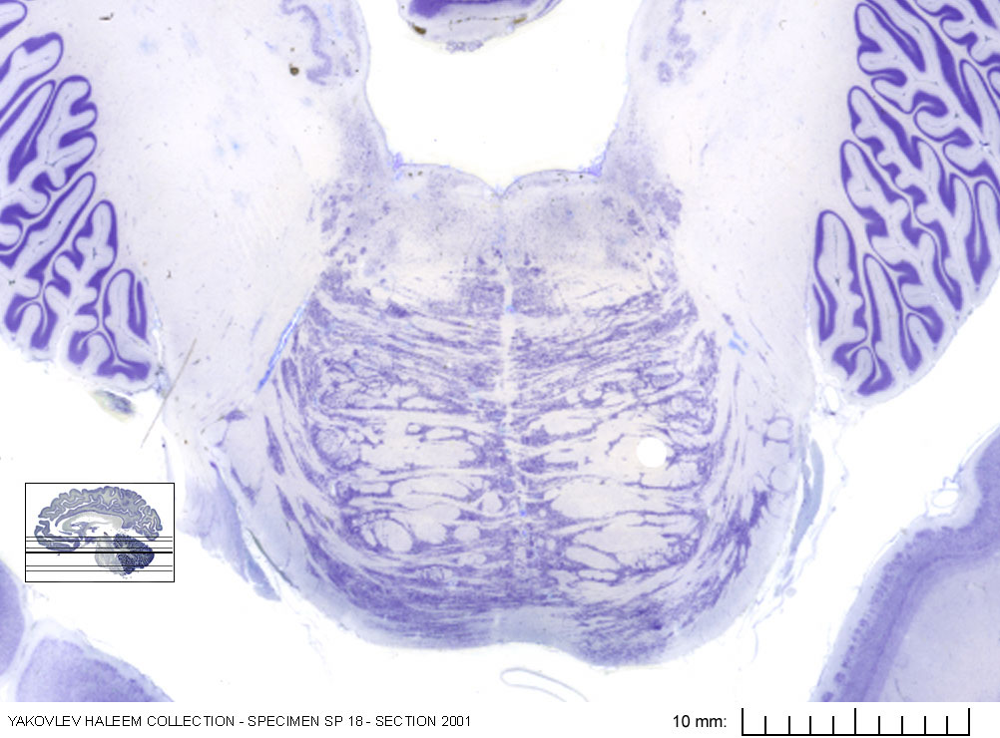

#  The Metencephalon

In this laboratory session, we will study the anatomy of the human metencephalon. The metencephalon is the embryonic part of the hindbrain that differentiates into the pons and the cerebellum. It contains a portion of the fourth ventricle and the trigeminal nerve (CN V), abducens nerve (CN VI), facial nerve (CN VII), and a portion of the vestibulocochlear nerve (CN VIII).

Below, you will be presented with a number of figures and asked to label or color certain structures in each figure.       
        
## A Series Of Coronal Sections Of A Human Brain 

In Figure \@ref(fig:2060), label the following structures:

1. The pons

(ref:c2060) Coronal section from [The Human Brain Atlas](https://msu.edu/~brains/brains/human/index.html) at the [Michigan State University Brain Biodiveristy Bank](https://msu.edu/~brains/copyright.html) which [acknowledges](https://msu.edu/~brains/copyright.html) their support from the National Science Foundation. 


```{r 2060, fig.cap='(ref:c2060)', echo=FALSE, message=FALSE, warning=FALSE}
knitr::include_graphics("./figures/cns/2060_cell.jpg")
```

In Figure \@ref(fig:2240), label the following structures:

1. The pons

(ref:c2240) Coronal section from [The Human Brain Atlas](https://msu.edu/~brains/brains/human/index.html) at the [Michigan State University Brain Biodiveristy Bank](https://msu.edu/~brains/copyright.html) which [acknowledges](https://msu.edu/~brains/copyright.html) their support from the National Science Foundation. 


```{r 2240, fig.cap='(ref:c2240)', echo=FALSE, message=FALSE, warning=FALSE}
knitr::include_graphics("./figures/cns/2240_cell.jpg")
```

In Figure \@ref(fig:2390), label the following structures:

1. The oculomotor nucleus
1. The medial longitudinal fasciculus
1. The parahippocampal gyrus
1. The cerebellum
1. The pons
1. The pyramidal tract


(ref:c2390) Coronal section from [The Human Brain Atlas](https://msu.edu/~brains/brains/human/index.html) at the [Michigan State University Brain Biodiveristy Bank](https://msu.edu/~brains/copyright.html) which [acknowledges](https://msu.edu/~brains/copyright.html) their support from the National Science Foundation. 


```{r 2390, fig.cap='(ref:c2390)', echo=FALSE, message=FALSE, warning=FALSE}
knitr::include_graphics("./figures/cns/2390_cell.jpg")
```

In Figure \@ref(fig:2500), label the following structures:

1. The superior cerebellar peduncle
1. The inferior olive
1. The 4^th^ ventricle
1. The lateral ventricle
1. The inferior colliculus
1. The cerebellum
1. The middle cerebellar peduncle
1. The pontine reticular formation


(ref:c2500) Coronal section from [The Human Brain Atlas](https://msu.edu/~brains/brains/human/index.html) at the [Michigan State University Brain Biodiveristy Bank](https://msu.edu/~brains/copyright.html) which [acknowledges](https://msu.edu/~brains/copyright.html) their support from the National Science Foundation. 


```{r 2500, fig.cap='(ref:c2500)', echo=FALSE, message=FALSE, warning=FALSE}
knitr::include_graphics("./figures/cns/2500_cell.jpg")
```

In Figure \@ref(fig:2660), label the following structures:

1. The dentate gyrus
1. The medial vestibular nucleus
1. The nucleus of the solitary tract
1. The solitary tract
1. The lateral ventricle
1. The 4^th^ ventricle
1. The inferior cerebellar peduncle
1. The inferior olive

(ref:c2660) Coronal section from [The Human Brain Atlas](https://msu.edu/~brains/brains/human/index.html) at the [Michigan State University Brain Biodiveristy Bank](https://msu.edu/~brains/copyright.html) which [acknowledges](https://msu.edu/~brains/copyright.html) their support from the National Science Foundation. 


```{r 2660, fig.cap='(ref:c2660)', echo=FALSE, message=FALSE, warning=FALSE}
knitr::include_graphics("./figures/cns/2660_cell.jpg")
```

In Figure \@ref(fig:2800), label the following structures:

1. The lateral ventricle
1. The vermis
1. The cerebellum
1. The inferior olive


(ref:c2800) Coronal section from [The Human Brain Atlas](https://msu.edu/~brains/brains/human/index.html) at the [Michigan State University Brain Biodiveristy Bank](https://msu.edu/~brains/copyright.html) which [acknowledges](https://msu.edu/~brains/copyright.html) their support from the National Science Foundation. 


```{r 2800, fig.cap='(ref:c2800)', echo=FALSE, message=FALSE, warning=FALSE}
knitr::include_graphics("./figures/cns/2800_cell.jpg")
```

In Figure \@ref(fig:3270), label the following structures:

1. The vermis
1. The cerebellum

(ref:c3270) Coronal section from [The Human Brain Atlas](https://msu.edu/~brains/brains/human/index.html) at the [Michigan State University Brain Biodiveristy Bank](https://msu.edu/~brains/copyright.html) which [acknowledges](https://msu.edu/~brains/copyright.html) their support from the National Science Foundation. 


```{r 3270, fig.cap='(ref:c3270)', echo=FALSE, message=FALSE, warning=FALSE}
knitr::include_graphics("./figures/cns/3270_cell.jpg")
```

##  A Series Of Sagittal Sections Of A Human Brain  

In Figure \@ref(fig:902), label the following structures:

1. The cerebellum

(ref:s902) Sagittal section from [The Human Brain Atlas](https://msu.edu/~brains/brains/human/index.html) at the [Michigan State University Brain Biodiveristy Bank](https://msu.edu/~brains/copyright.html) which [acknowledges](https://msu.edu/~brains/copyright.html) their support from the National Science Foundation. 

```{r 902, fig.cap='(ref:s902)', echo=FALSE, message=FALSE, warning=FALSE}
knitr::include_graphics("./figures/cns/0902_cell.jpg")
```


In Figure \@ref(fig:842), label the following structures:

1. The cerebellum

(ref:s842) Sagittal section from [The Human Brain Atlas](https://msu.edu/~brains/brains/human/index.html) at the [Michigan State University Brain Biodiveristy Bank](https://msu.edu/~brains/copyright.html) which [acknowledges](https://msu.edu/~brains/copyright.html) their support from the National Science Foundation. 

```{r 842, fig.cap='(ref:s842)', echo=FALSE, message=FALSE, warning=FALSE}
knitr::include_graphics("./figures/cns/0842_cell.jpg")
```


In Figure \@ref(fig:782), label the following structures:

1. The cerebellum

(ref:s782) Sagittal section from [The Human Brain Atlas](https://msu.edu/~brains/brains/human/index.html) at the [Michigan State University Brain Biodiveristy Bank](https://msu.edu/~brains/copyright.html) which [acknowledges](https://msu.edu/~brains/copyright.html) their support from the National Science Foundation. 

```{r 782, fig.cap='(ref:s782)', echo=FALSE, message=FALSE, warning=FALSE}
knitr::include_graphics("./figures/cns/0782_cell.jpg")
```


In Figure \@ref(fig:722), label the following structures:

1. The cerebellum

(ref:s722) Sagittal section from [The Human Brain Atlas](https://msu.edu/~brains/brains/human/index.html) at the [Michigan State University Brain Biodiveristy Bank](https://msu.edu/~brains/copyright.html) which [acknowledges](https://msu.edu/~brains/copyright.html) their support from the National Science Foundation. 

```{r 722, fig.cap='(ref:s722)', echo=FALSE, message=FALSE, warning=FALSE}

```


In Figure \@ref(fig:572), label the following structures:

1. The middle cerebellar peduncle
1. The cerebellum

(ref:572) Sagittal section from [The Human Brain Atlas](https://msu.edu/~brains/brains/human/index.html) at the [Michigan State University Brain Biodiveristy Bank](https://msu.edu/~brains/copyright.html) which [acknowledges](https://msu.edu/~brains/copyright.html) their support from the National Science Foundation. 

```{r 572, fig.cap='(ref:s572)', echo=FALSE, message=FALSE, warning=FALSE}
knitr::include_graphics("./figures/cns/0572_cell.jpg")
```


In Figure \@ref(fig:512), label the following structures:

1. The middle cerebellar peduncle
1. The cerebellum

(ref:s512) Sagittal section from [The Human Brain Atlas](https://msu.edu/~brains/brains/human/index.html) at the [Michigan State University Brain Biodiveristy Bank](https://msu.edu/~brains/copyright.html) which [acknowledges](https://msu.edu/~brains/copyright.html) their support from the National Science Foundation. 

```{r 512, fig.cap='(ref:s512)', echo=FALSE, message=FALSE, warning=FALSE}
knitr::include_graphics("./figures/cns/0512_cell.jpg")
```


In Figure \@ref(fig:452), label the following structures:

1. The middle cerebellar peduncle
1. The cerebellum

(ref:s452) Sagittal section from [The Human Brain Atlas](https://msu.edu/~brains/brains/human/index.html) at the [Michigan State University Brain Biodiveristy Bank](https://msu.edu/~brains/copyright.html) which [acknowledges](https://msu.edu/~brains/copyright.html) their support from the National Science Foundation. 

```{r 452, fig.cap='(ref:s452)', echo=FALSE, message=FALSE, warning=FALSE}
knitr::include_graphics("./figures/cns/0452_cell.jpg")
```


In Figure \@ref(fig:392), label the following structures:

1. The middle cerebellar peduncle
1. The cerebellum

(ref:s392) Sagittal section from [The Human Brain Atlas](https://msu.edu/~brains/brains/human/index.html) at the [Michigan State University Brain Biodiveristy Bank](https://msu.edu/~brains/copyright.html) which [acknowledges](https://msu.edu/~brains/copyright.html) their support from the National Science Foundation. 

```{r 392, fig.cap='(ref:s392)', echo=FALSE, message=FALSE, warning=FALSE}
knitr::include_graphics("./figures/cns/0392_cell.jpg")
```


In Figure \@ref(fig:332), label the following structures:

1. The pontine nuclei
1. The middle cerebellar peduncle
1. The cerebellum
1. The inferior cerebellar peduncle


(ref:s332) Sagittal section from [The Human Brain Atlas](https://msu.edu/~brains/brains/human/index.html) at the [Michigan State University Brain Biodiveristy Bank](https://msu.edu/~brains/copyright.html) which [acknowledges](https://msu.edu/~brains/copyright.html) their support from the National Science Foundation. 

```{r 332, fig.cap='(ref:s332)', echo=FALSE, message=FALSE, warning=FALSE}
knitr::include_graphics("./figures/cns/0332_cell.jpg")
```


In Figure \@ref(fig:302), label the following structures:

1. The pontine nuclei
1. The inferior cerebellar peduncle
1. The cerebellum

(ref:s302) Sagittal section from [The Human Brain Atlas](https://msu.edu/~brains/brains/human/index.html) at the [Michigan State University Brain Biodiveristy Bank](https://msu.edu/~brains/copyright.html) which [acknowledges](https://msu.edu/~brains/copyright.html) their support from the National Science Foundation. 

```{r 302, fig.cap='(ref:s302)', echo=FALSE, message=FALSE, warning=FALSE}
knitr::include_graphics("./figures/cns/0302_cell.jpg")
```


In Figure \@ref(fig:272), label the following structures:

1. The pontine nuclei
1. The superior cerebellar peduncle
1. The inferior cerebellar peduncle
1. The cerebellum

(ref:s272) Sagittal section from [The Human Brain Atlas](https://msu.edu/~brains/brains/human/index.html) at the [Michigan State University Brain Biodiveristy Bank](https://msu.edu/~brains/copyright.html) which [acknowledges](https://msu.edu/~brains/copyright.html) their support from the National Science Foundation. 

```{r 272, fig.cap='(ref:s272)', echo=FALSE, message=FALSE, warning=FALSE}
knitr::include_graphics("./figures/cns/0272_cell.jpg")
```


In Figure \@ref(fig:242), label the following structures:

1. The pontine nuclei
1. The inferior olive
1. The cerebellar tonsil
1. The superior cerebellar peduncle
1. The inferior cerebellar peduncle
1. The cerebellum

(ref:s242) Sagittal section from [The Human Brain Atlas](https://msu.edu/~brains/brains/human/index.html) at the [Michigan State University Brain Biodiveristy Bank](https://msu.edu/~brains/copyright.html) which [acknowledges](https://msu.edu/~brains/copyright.html) their support from the National Science Foundation. 

```{r 242, fig.cap='(ref:s242)', echo=FALSE, message=FALSE, warning=FALSE}
knitr::include_graphics("./figures/cns/0242_cell.jpg")
```


In Figure \@ref(fig:212), label the following structures:

1. The pontine nuclei
1. The inferior olive
1. The cerebellar tonsil
1. The superior cerebellar peduncle
1. The cerebellum

(ref:s212) Sagittal section from [The Human Brain Atlas](https://msu.edu/~brains/brains/human/index.html) at the [Michigan State University Brain Biodiveristy Bank](https://msu.edu/~brains/copyright.html) which [acknowledges](https://msu.edu/~brains/copyright.html) their support from the National Science Foundation. 

```{r 212, fig.cap='(ref:s212)', echo=FALSE, message=FALSE, warning=FALSE}
knitr::include_graphics("./figures/cns/0212_cell.jpg")
```


In Figure \@ref(fig:182), label the following structures:

1. The pontine nuclei
1. The inferior olive
1. The cerebellar tonsil
1. The decussation of the superior cerebellar peduncle
1. The cerebellum

(ref:s182) Sagittal section from [The Human Brain Atlas](https://msu.edu/~brains/brains/human/index.html) at the [Michigan State University Brain Biodiveristy Bank](https://msu.edu/~brains/copyright.html) which [acknowledges](https://msu.edu/~brains/copyright.html) their support from the National Science Foundation. 

```{r 182, fig.cap='(ref:s182)', echo=FALSE, message=FALSE, warning=FALSE}
knitr::include_graphics("./figures/cns/0182_cell.jpg")
```

In Figure \@ref(fig:152), label the following structures:

1. The pontine nuclei
1. The inferior olive
1. The cerebellar tonsil
1. The decussation of the superior cerebellar peduncle
1. The cerebellum
1. The gracile nucleus
1. The cuneate fasciculus
1. The 4^th^ ventricle

(ref:s152) Sagittal section from [The Human Brain Atlas](https://msu.edu/~brains/brains/human/index.html) at the [Michigan State University Brain Biodiveristy Bank](https://msu.edu/~brains/copyright.html) which [acknowledges](https://msu.edu/~brains/copyright.html) their support from the National Science Foundation. 

```{r 152, fig.cap='(ref:s152)', echo=FALSE, message=FALSE, warning=FALSE}
knitr::include_graphics("./figures/cns/0182_cell.jpg")
```

##  A Series Of Horizontal Sections Of A Human Brain  


In Figure \@ref(fig:1400), label the following structures:

1. The medial longitudinal fissure
1. The vermis of the cerebellum


(ref:h1400) Horizontal section from [The Human Brain Atlas](https://msu.edu/~brains/brains/human/index.html) at the [Michigan State University Brain Biodiveristy Bank](https://msu.edu/~brains/copyright.html) which [acknowledges](https://msu.edu/~brains/copyright.html) their support from the National Science Foundation. 

```{r 1400, fig.cap='(ref:h1400)', echo=FALSE, message=FALSE, warning=FALSE}

```

In Figure \@ref(fig:1500), label the following structures:

1. The cerebellum

(ref:h1500) Horizontal section from [The Human Brain Atlas](https://msu.edu/~brains/brains/human/index.html) at the [Michigan State University Brain Biodiveristy Bank](https://msu.edu/~brains/copyright.html) which [acknowledges](https://msu.edu/~brains/copyright.html) their support from the National Science Foundation. 

```{r 1500, fig.cap='(ref:h1500)', echo=FALSE, message=FALSE, warning=FALSE}
knitr::include_graphics("./figures/cns/horizontal/1500_cell.jpg")
```

In Figure \@ref(fig:1600), label the following structures:

1. The cerebral aqueduct
1. The cerebellum
1. The vermis of the cerebellum

(ref:h1600) Horizontal section from [The Human Brain Atlas](https://msu.edu/~brains/brains/human/index.html) at the [Michigan State University Brain Biodiveristy Bank](https://msu.edu/~brains/copyright.html) which [acknowledges](https://msu.edu/~brains/copyright.html) their support from the National Science Foundation. 

```{r 1600, fig.cap='(ref:h1600)', echo=FALSE, message=FALSE, warning=FALSE}

```

In Figure \@ref(fig:1640), label the following structures:

1. The cerebellum
1. The vermis of the cerebellum

(ref:h1640) Horizontal section from [The Human Brain Atlas](https://msu.edu/~brains/brains/human/index.html) at the [Michigan State University Brain Biodiveristy Bank](https://msu.edu/~brains/copyright.html) which [acknowledges](https://msu.edu/~brains/copyright.html) their support from the National Science Foundation. 

```{r 1640, fig.cap='(ref:h1640)', echo=FALSE, message=FALSE, warning=FALSE}
knitr::include_graphics("./figures/cns/horizontal/1640_cell.jpg")
```

In Figure \@ref(fig:1700), label the following structures:

1. The cerebellum
1. The vermis of the cerebellum

(ref:h1700) Horizontal section from [The Human Brain Atlas](https://msu.edu/~brains/brains/human/index.html) at the [Michigan State University Brain Biodiveristy Bank](https://msu.edu/~brains/copyright.html) which [acknowledges](https://msu.edu/~brains/copyright.html) their support from the National Science Foundation. 

```{r 1700, fig.cap='(ref:h1700)', echo=FALSE, message=FALSE, warning=FALSE}
knitr::include_graphics("./figures/cns/horizontal/1700_cell.jpg")
```

In Figure \@ref(fig:1740), label the following structures:

1. The locus coeruleus
1. The cerebellum
1. The vermis of the cerebellum
1. The 4^th^ ventricle


(ref:h1740) Horizontal section from [The Human Brain Atlas](https://msu.edu/~brains/brains/human/index.html) at the [Michigan State University Brain Biodiveristy Bank](https://msu.edu/~brains/copyright.html) which [acknowledges](https://msu.edu/~brains/copyright.html) their support from the National Science Foundation. 

```{r 1740, fig.cap='(ref:h1740)', echo=FALSE, message=FALSE, warning=FALSE}
knitr::include_graphics("./figures/cns/horizontal/1740_cell.jpg")
```

In Figure \@ref(fig:1800), label the following structures:

1. The central grey of the pons
1. The locus coeruleus
1. The cerebellum
1. The vermis of the cerebellum
1. The 4^th^ ventricle
1. The trigeminal nerve
1. The superior cerebellar peduncle


(ref:h1800) Horizontal section from [The Human Brain Atlas](https://msu.edu/~brains/brains/human/index.html) at the [Michigan State University Brain Biodiveristy Bank](https://msu.edu/~brains/copyright.html) which [acknowledges](https://msu.edu/~brains/copyright.html) their support from the National Science Foundation. 

```{r 1800, fig.cap='(ref:h1800)', echo=FALSE, message=FALSE, warning=FALSE}

```

In Figure \@ref(fig:ho1840), label the following structures:

1. The central grey of the pons
1. The locus coeruleus
1. The cerebellum
1. The vermis of the cerebellum
1. The medial lemniscus
1. The 4^th^ ventricle
1. The trigeminal nerve
1. The superior cerebellar peduncle
1. The central tegmental tract
1. The dentate nucleus
1. The emboliform nucleus
1. The fastigial nucleus

(ref:h1840) Horizontal section from [The Human Brain Atlas](https://msu.edu/~brains/brains/human/index.html) at the [Michigan State University Brain Biodiveristy Bank](https://msu.edu/~brains/copyright.html) which [acknowledges](https://msu.edu/~brains/copyright.html) their support from the National Science Foundation. 

```{r ho1840, fig.cap='(ref:h1840)', echo=FALSE, message=FALSE, warning=FALSE}

```

In Figure \@ref(fig:1900), label the following structures:

1. The central grey of the pons
1. The locus coeruleus
1. The cerebellum
1. The vermis of the cerebellum
1. The medial lemniscus
1. The 4^th^ ventricle
1. The trigeminal nerve
1. The superior cerebellar peduncle
1. The emboliform nucleus
1. The fastigial nucleus
1. The medial lemniscus
1. The entorhinal cortex


(ref:h1900) Horizontal section from [The Human Brain Atlas](https://msu.edu/~brains/brains/human/index.html) at the [Michigan State University Brain Biodiveristy Bank](https://msu.edu/~brains/copyright.html) which [acknowledges](https://msu.edu/~brains/copyright.html) their support from the National Science Foundation. 

```{r 1900, fig.cap='(ref:h1900)', echo=FALSE, message=FALSE, warning=FALSE}

```

In Figure \@ref(fig:ho2000), label the following structures:

1. The solitary tract and nucleus
1. The facial nucleus
1. The facial nerve root
1. The olivary nuclei
1. The raphe nuclei
1. The central grey of the pons
1. The 3^d^ ventricle
1. The locus coeruleus
1. The cerebellum
1. The vermis of the cerebellum
1. The 4^th^ ventricle
1. The trigeminal nerve
1. The superior cerebellar peduncle
1. The superior vestibular nucleus
1. The spinal trigeminal nucleus
1. The middle cerebellar peduncle
1. The central tegmental tract
1. The reticular formation


(ref:h2000) Horizontal section from [The Human Brain Atlas](https://msu.edu/~brains/brains/human/index.html) at the [Michigan State University Brain Biodiveristy Bank](https://msu.edu/~brains/copyright.html) which [acknowledges](https://msu.edu/~brains/copyright.html) their support from the National Science Foundation. 

```{r ho2000, fig.cap='(ref:h2000)', echo=FALSE, message=FALSE, warning=FALSE}
knitr::include_graphics("./figures/cns/horizontal/2000_cell.jpg")
```

In Figure \@ref(fig:2100), label the following structures:

1. The solitary tract and nucleus
1. The facial motor nucleus
1. The corticospinal fibers
1. The superior olivary nuclei
1. The cerebellum
1. The vermis of the cerebellum
1. The 4^th^ ventricle
1. The trigeminal nerve
1. The superior cerebellar peduncle
1. The superior vestibular nucleus
1. The spinal trigeminal nucleus
1. The spinal trigeminal tract
1. The middle cerebellar peduncle
1. The central tegmental tract
1. The reticular formation
1. The middle cerebellar peduncle
1. The cerebellar tonsil
1. The medial longitudinal fasciculus
1. The medial vestibular nucleus


(ref:h2100) Horizontal section from [The Human Brain Atlas](https://msu.edu/~brains/brains/human/index.html) at the [Michigan State University Brain Biodiveristy Bank](https://msu.edu/~brains/copyright.html) which [acknowledges](https://msu.edu/~brains/copyright.html) their support from the National Science Foundation. 

```{r 2100, fig.cap='(ref:h2100)', echo=FALSE, message=FALSE, warning=FALSE}
knitr::include_graphics("./figures/cns/horizontal/2100_cell.jpg")
```

In Figure \@ref(fig:2200), label the following structures:

1. The solitary tract and nucleus
1. The corticospinal fibers
1. The cerebellum
1. The vermis of the cerebellum
1. The 4^th^ ventricle
1. The inferior cerebellar peduncle
1. The medial vestibular nucleus
1. The spinal trigeminal nucleus
1. The spinal trigeminal tract
1. The inferior cerebellar peduncle
1. The cerebellar tonsil
1. The medial longitudinal fasciculus
1. The ventral cochlear nucleus
1. The dorsal cochlear nucleus
1. The hypoglossal nucleus
1. The inferior vestibular nucleus
1. The pontine nuclei
1. The inferior olive
1. The medial lemniscus

(ref:h2200) Horizontal section from [The Human Brain Atlas](https://msu.edu/~brains/brains/human/index.html) at the [Michigan State University Brain Biodiveristy Bank](https://msu.edu/~brains/copyright.html) which [acknowledges](https://msu.edu/~brains/copyright.html) their support from the National Science Foundation. 

```{r 2200, fig.cap='(ref:h2200)', echo=FALSE, message=FALSE, warning=FALSE}
knitr::include_graphics("./figures/cns/horizontal/2200_cell.jpg")
```

In Figure \@ref(fig:ho2240), label the following structures:

1. The solitary tract and nucleus
1. The corticospinal fibers
1. The cerebellum
1. The 4^th^ ventricle
1. The inferior cerebellar peduncle
1. The inferior vestibular nucleus
1. The spinal trigeminal tract
1. The inferior cerebellar peduncle
1. The cerebellar tonsil
1. The medial longitudinal fasciculus
1. The ventral cochlear nucleus
1. The dorsal cochlear nucleus
1. The hypoglossal nucleus
1. The inferior vestibular nucleus
1. The pontine nuclei
1. The inferior olive
1. The medial lemniscus
1. The choroid plexus

(ref:h2240) Horizontal section from [The Human Brain Atlas](https://msu.edu/~brains/brains/human/index.html) at the [Michigan State University Brain Biodiveristy Bank](https://msu.edu/~brains/copyright.html) which [acknowledges](https://msu.edu/~brains/copyright.html) their support from the National Science Foundation. 

```{r ho2240, fig.cap='(ref:h2240)', echo=FALSE, message=FALSE, warning=FALSE}
knitr::include_graphics("./figures/cns/horizontal/2240_cell.jpg")
```

In Figure \@ref(fig:2260), label the following structures:

1. The corticospinal fibers
1. The cerebellum
1. The 4^th^ ventricle
1. The inferior cerebellar peduncle
1. The inferior vestibular nucleus
1. The cerebellar tonsil
1. The medial longitudinal fasciculus
1. The ventral cochlear nucleus
1. The hypoglossal nucleus
1. The inferior vestibular nucleus
1. The pontine nuclei
1. The inferior olive
1. The medial lemniscus
1. The choroid plexus
1. The dorsal cochlear nucleus
1. The external cuneate nucleus
1. The dorsal motor nucleus of the vagus 
1. The solitary nucleus
1. The hypoglossal nucleus
1. The spinal trigeminal nucleus
1. The spinal trigeminal tract


(ref:h2260) Horizontal section from [The Human Brain Atlas](https://msu.edu/~brains/brains/human/index.html) at the [Michigan State University Brain Biodiveristy Bank](https://msu.edu/~brains/copyright.html) which [acknowledges](https://msu.edu/~brains/copyright.html) their support from the National Science Foundation. 

```{r 2260, fig.cap='(ref:h2260)', echo=FALSE, message=FALSE, warning=FALSE}
knitr::include_graphics("./figures/cns/horizontal/2260_cell.jpg")
```

In Figure \@ref(fig:2280), label the following structures:

1. The corticospinal fibers
1. The cerebellum
1. The 4^th^ ventricle
1. The inferior cerebellar peduncle
1. The inferior vestibular nucleus
1. The cerebellar tonsil
1. The cuneate nucleus
1. The external cuneate nucleus
1. The vestibulocochlear nerve
1. The medial longitudinal fasciculus
1. The dorsal cochlear nucleus
1. The hypoglossal nucleus
1. The inferior vestibular nucleus
1. The medial lemniscus
1. The choroid plexus
1. The dorsal cochlear nucleus
1. The dorsal motor nucleus of the vagus 
1. The solitary nucleus
1. The spinal trigeminal nucleus
1. The spinal trigeminal tract
1. The solitary tract

(ref:h2280) Horizontal section from [The Human Brain Atlas](https://msu.edu/~brains/brains/human/index.html) at the [Michigan State University Brain Biodiveristy Bank](https://msu.edu/~brains/copyright.html) which [acknowledges](https://msu.edu/~brains/copyright.html) their support from the National Science Foundation. 

```{r 2280, fig.cap='(ref:h2280)', echo=FALSE, message=FALSE, warning=FALSE}
knitr::include_graphics("./figures/cns/horizontal/2280_cell.jpg")
```

In Figure \@ref(fig:2300), label the following structures:

1. The corticospinal fibers
1. The cerebellum
1. The 4^th^ ventricle
1. The inferior cerebellar peduncle
1. The inferior vestibular nucleus
1. The cerebellar tonsil
1. The external cuneate nucleus
1. The medial longitudinal fasciculus
1. The hypoglossal nucleus
1. The decussatin of the medial lemniscus
1. The dorsal motor nucleus of the vagus 
1. The solitary nucleus
1. The spinal trigeminal nucleus
1. The spinal trigeminal tract
1. The solitary tract
1. The lateral reticular nucleus
1. The gracile nucleus

(ref:h2300) Horizontal section from [The Human Brain Atlas](https://msu.edu/~brains/brains/human/index.html) at the [Michigan State University Brain Biodiveristy Bank](https://msu.edu/~brains/copyright.html) which [acknowledges](https://msu.edu/~brains/copyright.html) their support from the National Science Foundation. 

```{r 2300, fig.cap='(ref:h2300)', echo=FALSE, message=FALSE, warning=FALSE}
knitr::include_graphics("./figures/cns/horizontal/2300_cell.jpg")
```

In Figure \@ref(fig:2340), label the following structures:

1. The corticospinal fibers
1. The cerebellum
1. The 4^th^ ventricle
1. The inferior cerebellar peduncle
1. The inferior vestibular nucleus
1. The cerebellar tonsil
1. The external cuneate nucleus
1. The medial longitudinal fasciculus
1. The hypoglossal nucleus
1. The decussatin of the medial lemniscus
1. The dorsal motor nucleus of the vagus 
1. The solitary nucleus
1. The spinal trigeminal nucleus
1. The spinal trigeminal tract
1. The solitary tract
1. The lateral reticular nucleus
1. The gracile nucleus


(ref:h2340) Horizontal section from [The Human Brain Atlas](https://msu.edu/~brains/brains/human/index.html) at the [Michigan State University Brain Biodiveristy Bank](https://msu.edu/~brains/copyright.html) which [acknowledges](https://msu.edu/~brains/copyright.html) their support from the National Science Foundation. 

```{r 2340, fig.cap='(ref:h2340)', echo=FALSE, message=FALSE, warning=FALSE}

```

In Figure \@ref(fig:2400), label the following structures:

1. The corticospinal fibers
1. The pyramids
1. The accessory nucleus
1. The cerebellum
1. The 4^th^ ventricle
1. The inferior cerebellar peduncle
1. The inferior vestibular nucleus
1. The cerebellar tonsil
1. The cuneate nucleus
1. The medial longitudinal fasciculus
1. The hypoglossal nucleus
1. The decussatin of the medial lemniscus
1. The solitary nucleus
1. The spinal trigeminal nucleus
1. The spinal trigeminal tract
1. The solitary tract
1. The lateral reticular nucleus
1. The gracile nucleus
1. The inferior cerebellar peduncle

(ref:h2400) Horizontal section from [The Human Brain Atlas](https://msu.edu/~brains/brains/human/index.html) at the [Michigan State University Brain Biodiveristy Bank](https://msu.edu/~brains/copyright.html) which [acknowledges](https://msu.edu/~brains/copyright.html) their support from the National Science Foundation. 

```{r 2400, fig.cap='(ref:h2400)', echo=FALSE, message=FALSE, warning=FALSE}
knitr::include_graphics("./figures/cns/horizontal/2400_cell.jpg")
```

In Figure \@ref(fig:2440), label the following structures:

1. The pyramids
1. The pyramidal decussation
1. The accessory nucleus
1. The cerebellum
1. The 4^th^ ventricle
1. The inferior cerebellar peduncle
1. The inferior vestibular nucleus
1. The cerebellar tonsil
1. The cuneate nucleus
1. The cuneate fasciculus
1. The medial longitudinal fasciculus
1. The spinal trigeminal nucleus
1. The spinal trigeminal tract
1. The solitary tract
1. The lateral reticular nucleus
1. The gracile nucleus
1. The gracile fasciculus
1. The medial motor nuclei

(ref:h2440) Horizontal section from [The Human Brain Atlas](https://msu.edu/~brains/brains/human/index.html) at the [Michigan State University Brain Biodiveristy Bank](https://msu.edu/~brains/copyright.html) which [acknowledges](https://msu.edu/~brains/copyright.html) their support from the National Science Foundation. 

```{r 2440, fig.cap='(ref:h2440)', echo=FALSE, message=FALSE, warning=FALSE}
knitr::include_graphics("./figures/cns/horizontal/2440_cell.jpg")
```

In Figure \@ref(fig:2480), label the following structures:

1. The pyramidal decussation
1. The accessory nucleus
1. The cerebellum
1. The cerebellar tonsil
1. The cuneate nucleus
1. The cuneate fasciculus
1. The spinal trigeminal nucleus
1. The substantia gelatinosa
1. The lateral reticular nucleus
1. The gracile nucleus
1. The gracile fasciculus
1. The medial motor nuclei
1. The central grey

(ref:h2480) Horizontal section from [The Human Brain Atlas](https://msu.edu/~brains/brains/human/index.html) at the [Michigan State University Brain Biodiveristy Bank](https://msu.edu/~brains/copyright.html) which [acknowledges](https://msu.edu/~brains/copyright.html) their support from the National Science Foundation. 

```{r 2480, fig.cap='(ref:h2480)', echo=FALSE, message=FALSE, warning=FALSE}

```

In Figure \@ref(fig:1841), label the following structures:

1. The superior cerebellar peduncle
1. The middle cerebellar peduncle
1. The mesencephalic nucleus of cranial nerve V (trigeminal)
1. The pontine nuclei
1. The corticospinal fibers
1. The medial longitudinal fasciculus
1. The medial lemniscus
1. The cerebellum


(ref:bs1841) Horizontal section from [The Human Brain Atlas](https://msu.edu/~brains/brains/human/index.html) at the [Michigan State University Brain Biodiveristy Bank](https://msu.edu/~brains/copyright.html) which [acknowledges](https://msu.edu/~brains/copyright.html) their support from the National Science Foundation. 


```{r 1841, fig.cap='(ref:bs1841)', echo=FALSE, message=FALSE, warning=FALSE}

```

In Figure \@ref(fig:2001), label the following structures:

1. The inferior cerebellar peduncle
1. The 4^th^ ventricle
1. The middle cerebellar peduncle
1. The vestibular nuclei
1. The facial colliculus
1. The nucleus of cranial nerve VII (facial)
1. The root of cranial nerve VII (facial)
1. The nucleus of cranial verve VI (abducens)
1. The nucleus solitarius
1. The pontine nuclei
1. The corticospinal fibers
1. The medial longitudinal fasciculus
1. The cerebellum


(ref:bs2001) Horizontal section from [The Human Brain Atlas](https://msu.edu/~brains/brains/human/index.html) at the [Michigan State University Brain Biodiveristy Bank](https://msu.edu/~brains/copyright.html) which [acknowledges](https://msu.edu/~brains/copyright.html) their support from the National Science Foundation. 


```{r 2001, fig.cap='(ref:bs2001)', echo=FALSE, message=FALSE, warning=FALSE}

```

In Figure \@ref(fig:2261), label the following structures:

1. The vestibular nuclei
1. The accessory cuneate nucleus
1. The spinal trigeminal nucleus
1. The inferior olive
1. The 4^th^ ventricle
1. The nucleus ambiguus
1. The cerebellum
1. The reticular formation
1. The pontine reticular formation
1. The cerebellum
1. The pontine nuclei
1. The nucleus of cranial nerve XII (hypoglossus)
1. The dorsal motor nucleus of cranial nerve X (vagus)
1. The ventral cochlear nucleus
1. The cranial nerve VIII (vestibulocochlear)
1. The pyramid


(ref:bs2261) Horizontal section from [The Human Brain Atlas](https://msu.edu/~brains/brains/human/index.html) at the [Michigan State University Brain Biodiveristy Bank](https://msu.edu/~brains/copyright.html) which [acknowledges](https://msu.edu/~brains/copyright.html) their support from the National Science Foundation. 


```{r 2261, fig.cap='(ref:bs2261)', echo=FALSE, message=FALSE, warning=FALSE}
knitr::include_graphics("./figures/cns/brainstem/2260_cell_unlabelled.jpg")
```

In Figure \@ref(fig:2461), label the following structures:

1. The cuneate nucleus
1. The cuneate fasciculus
1. The gracile fasciculus
1. The gracile nucleus
1. The pyramidal decussation
1. The accessory nucleus
1. The cerebellum
1. The spinal nucleus of cranial nerve V (trigeminal)


(ref:bs2461) Horizontal section from [The Human Brain Atlas](https://msu.edu/~brains/brains/human/index.html) at the [Michigan State University Brain Biodiveristy Bank](https://msu.edu/~brains/copyright.html) which [acknowledges](https://msu.edu/~brains/copyright.html) their support from the National Science Foundation. 


```{r 2461, fig.cap='(ref:bs2461)', echo=FALSE, message=FALSE, warning=FALSE}
knitr::include_graphics("./figures/cns/brainstem/2460_cell_labelled.jpg")
```


