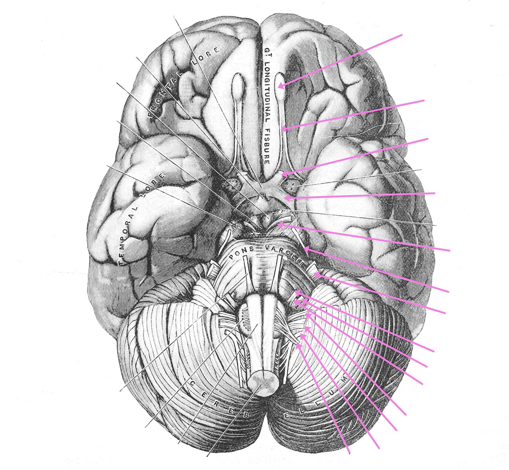

# The Peripheral Nervous System

In this laboratory session, we will study the anatomy of the peripheral nervous system.Below, you will be presented with a number of figures and asked to label or color certain structures in each figure.

In Figure \@ref(fig:baseview), label the following structures:

(ref:cranialnerves) View of the base of the brain. The cranial nerves are colored in purple and labeled with numbers on the left (1 to 12). From [Gray Henry, Anatomy of the Human Body. 20^th^ Edition, Lea & Febiger, Philadelphia & New York, 1918](https://archive.org/details/anatomyofhumanbo1918gray/page/n6/mode/2up) 
 

```{r baseview, fig.cap='(ref:cranialnerves)', echo=FALSE, message=FALSE, warning=FALSE}

```


