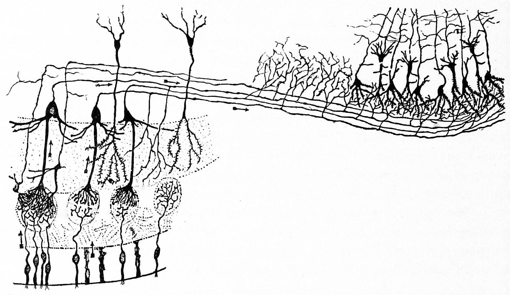
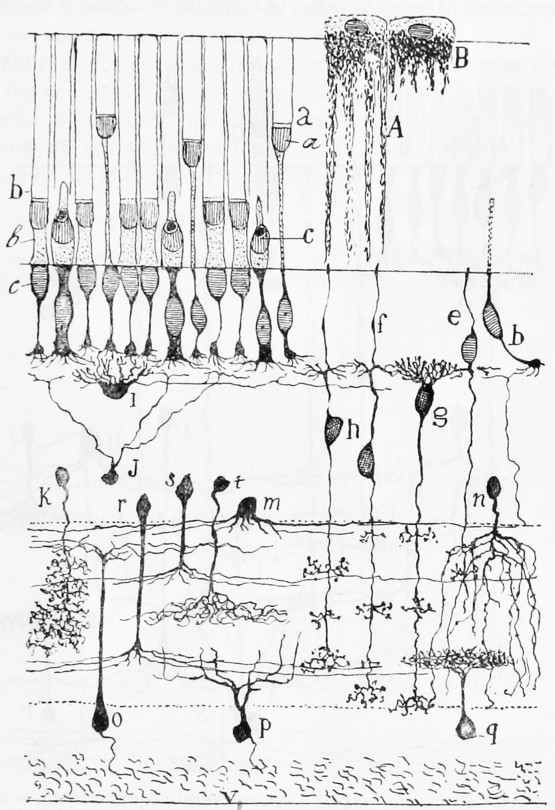

# The Sensory Systems

In this laboratory session, we will study aspects of the anatomy of the olfactory, gustatory, auditory and visual systems. Below, you will be presented with a number of figures and asked to label or color certain structures in each figure.

## The Olfactory System

In Figure \@ref(fig:olfactorypath) , label the following layers, structures, and cells:

1. Label the olfacory mucosa.
1. Label the glomeruli in the olfactory bulb.
1. Label the mitral cells.
1. Label the granule cells
1. Label the olfactory nerve.
1. Label the pyramidal cells in the olfactory cortex.


(ref:olf) Diagram of the structure of the olfactory bulb and olfactory cortex. [Histologie du système nerveux de l'homme & des vertébrés, Tome Premier](https://wellcomelibrary.org/item/b2129592x#?c=0&m=0&s=0&cv=14&z=0%2C-3.48%2C1%2C8.6591) (1909) by Santiago Ramón y Cajal translated from Spanish by Dr. L. Azoulay.

```{r olfactorypath, fig.cap='(ref:olf)', echo=FALSE, message=FALSE, warning=FALSE}

```

## The Gustatory System

In Figure \@ref(fig:gusta) , label the following structures:

1. Label a gustatory cell.
1. Label a supporting cell.
1. Label gustatory hairs.

(ref:gust) A vertical section of a taste bud from the papilla foliata of a rabbit (highly magnified). From [Textbook of anatomy. Section 2. The muscular system: the nervous system: the organs of sense and integument edited by D. J. Cunningham](https://wellcomelibrary.org/item/b21271070) 


```{r gusta, fig.cap='(ref:olf)', echo=FALSE, message=FALSE, warning=FALSE}

```

## The Auditory System

In Figure \@ref(fig:hearing) , label the following structures:

1. Label the Eustachian tube.
1. Label the cochlea.
1. Label the membrana tympani.
1. Label the pinna.
1. Label the tympanic cavity with the chain of ossicles (malleus, incus, and stapes).
1. Label the sacule.
1. Label the utricule.
1. Label the semicircular canals.


(ref:hear) Diagrammatic view of the hearing organ. From [Textbook of anatomy. Section 2. The muscular system: the nervous system: the organs of sense and integument edited by D. J. Cunningham](https://wellcomelibrary.org/item/b21271070) 

```{r hearing, fig.cap='(ref:hear)', echo=FALSE, message=FALSE, warning=FALSE}

```

In Figure \@ref(fig:cochlea) , label the following structures:

1. Label the vestibular membrane.
1. Label the scala vestibuli.
1. Label the scala tympani.
1. Label the cochlear nerve.
1. Label the spiral ganglion.
1. Label the organ of Corti.
1. Label the basilar membrane.

(ref:coch) Diagramatic longitudinal section of the cochlea. From [Gray Henry, Anatomy of the Human Body. 20^th^ Edition, Lea & Febiger, Philadelphia & New York, 1918](https://archive.org/details/anatomyofhumanbo1918gray/page/n6/mode/2up) 


```{r cochlea, fig.cap='(ref:coch)', echo=FALSE, message=FALSE, warning=FALSE}
knitr::include_graphics("./figures/senses/anatomyofhumanbo1918gray_1061_for_labelling.jpg")
```

In Figure \@ref(fig:corti) , label the following structures:

1. Label the membrana tectoria.
1. Label the scala outer hair cells.
1. Label the scala inner hair cells.
1. Label the scala tympani.
1. Label the basilar membrane.

(ref:cort) Section through the spiral organ of Corti (magnified). From [Gray Henry, Anatomy of the Human Body. 20^th^ Edition, Lea & Febiger, Philadelphia & New York, 1918](https://archive.org/details/anatomyofhumanbo1918gray/page/n6/mode/2up) 


```{r corti, fig.cap='(ref:cort)', echo=FALSE, message=FALSE, warning=FALSE}
knitr::include_graphics("./figures/senses/anatomyofhumanbo1918gray_1062_for_labelling.jpg")
```

## The Visual System

### The Eye

In Figure \@ref(fig:eye) , label the following structures:

1. Color the lens of the eye in yellow. 
1. Color the vitreous body in pink. 
1. Color the iris in brown.
1. Color the retina in green.
1. Color the sclera in blue.
1. Color the ciliary body in red.
1. Label the structures pointed to by the black lines with the appropriate anatomical name.

(ref:ey) A horizontal section of the eyball. 

```{r eye, fig.cap='(ref:ey)', echo=FALSE, message=FALSE, warning=FALSE}

```

### The Retina 

In Figure \@ref(fig:retcajal) , label the following layers, structures, and cells:

1. Photoreceptor layer.
2. Outer plexiform layer.
3. Internal nuclear layer.
4. Internal plexiform layer.
5. Ganglion cell layer.
6. Ganglion cell axons.
7. A cone.
8. A rod.
9. Horizontal cells.
10. Amacrine cells. 


(ref:retina) Vertical section of the adult human retina. Carmine and Nissl stain. Modified from Fig. 188 in [Histologie du système nerveux de l'homme & des vertébrés](https://wellcomelibrary.org/item/b2129592x#?c=0&m=0&s=0&cv=0&z=-0.9137%2C-0.0887%2C2.8274%2C1.7747) (1909) by Santiago Ramón y Cajal translated from Spanish by Dr. L. Azoulay.

```{r retcajal, fig.cap='(ref:retina)', echo=FALSE, message=FALSE, warning=FALSE}
knitr::include_graphics("./figures/senses/retina_cajal.png")
```

In Figure \@ref(fig:frogretina), label the following layers, structures, and cells:

1. A rod
1. A cone
1. Ahorizontal cell
1. A bipolar cell
1. Various types of amacrine cells
1. A ganglion cell
1. A displaced amacrine cell
1. A pigment epithelial cell with extended process
1. A pigment epithelial cell with retracted process

(ref:frogret) A semischematic diagram of the frog retina. 

```{r frogretina, fig.cap='(ref:frogret)', echo=FALSE, message=FALSE, warning=FALSE}

```

### Visual Areas Of The Cortex

1. Label the visual areas V1, V2, and V3 in Figures \@ref(fig:brodl) and \@ref(fig:brodm) :


```{r brodl, fig.cap='(ref:bl)', echo=FALSE, message=FALSE, warning=FALSE}
knitr::include_graphics("./figures/cns/Brodmann_lateral.jpg")
```


```{r brodm, fig.cap='(ref:bm)', echo=FALSE, message=FALSE, warning=FALSE}
knitr::include_graphics("./figures/cns/Brodmann_medial.jpg")
```

