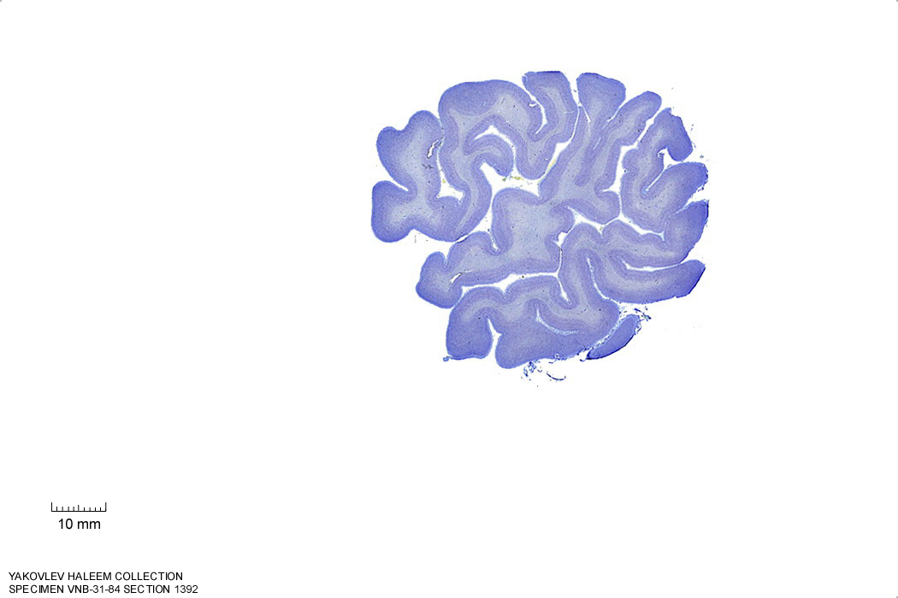
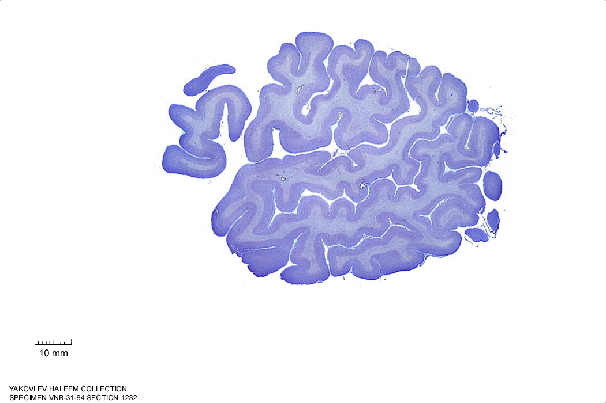
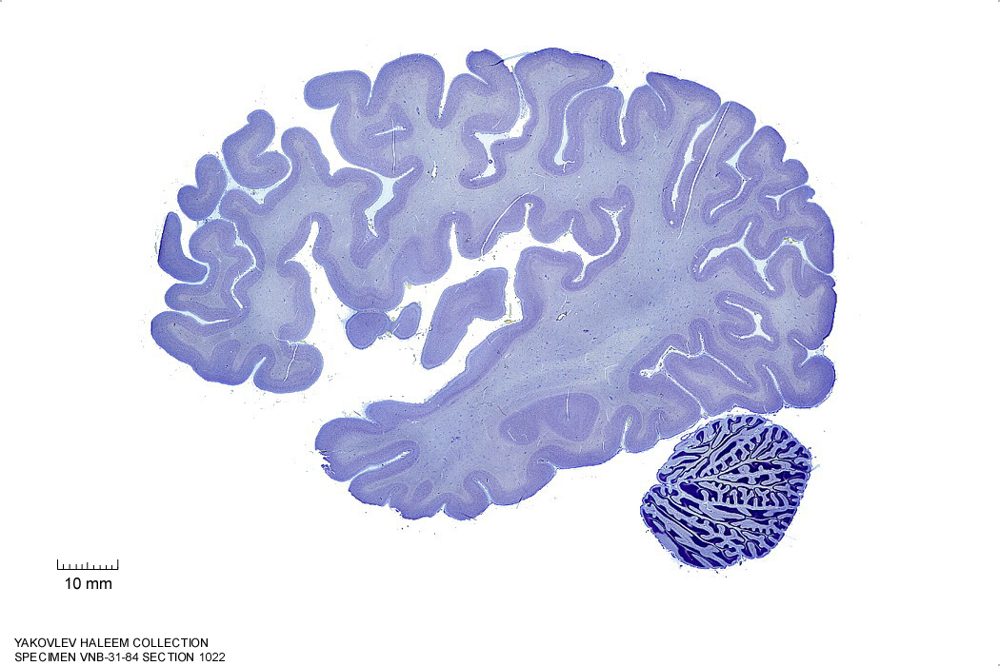
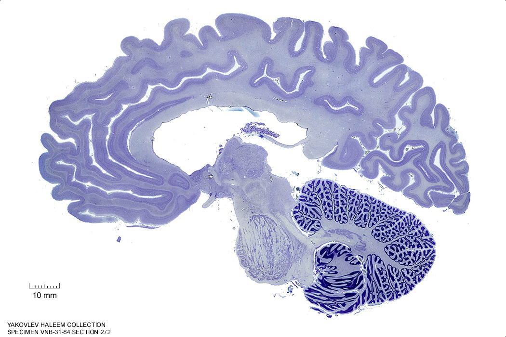
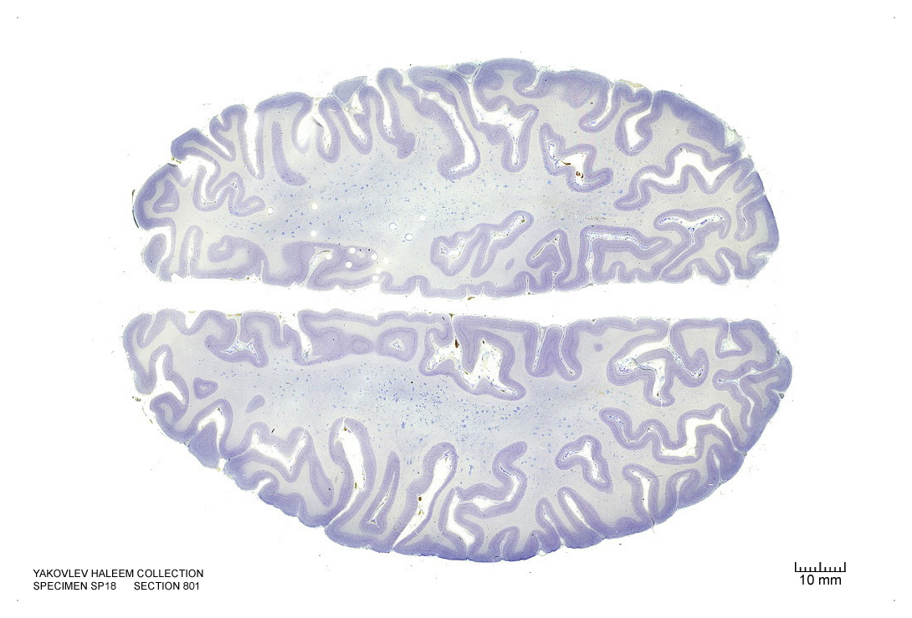
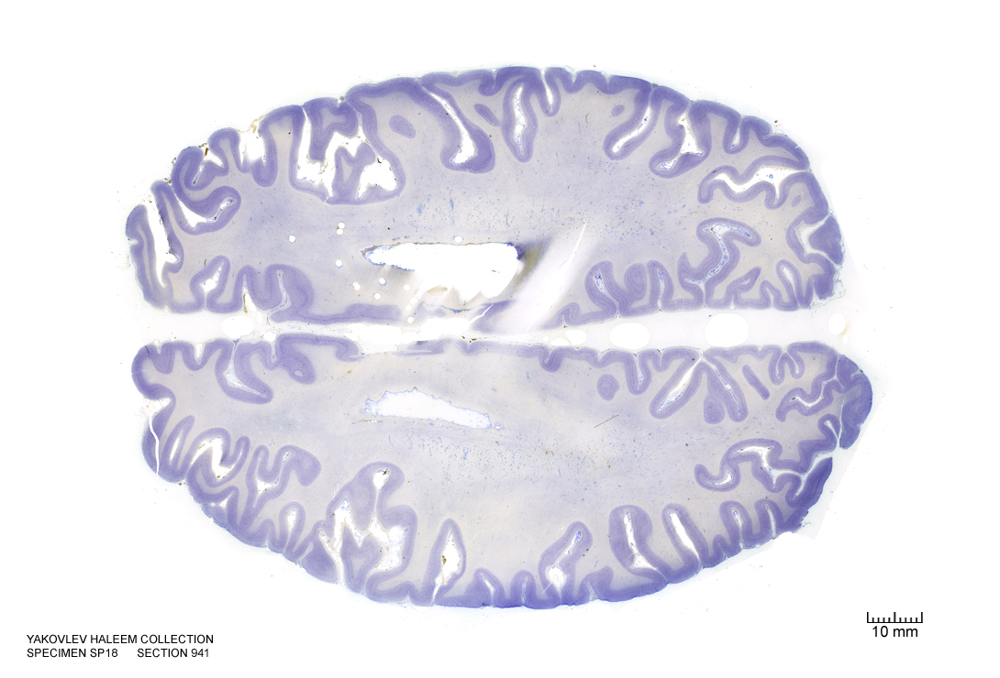
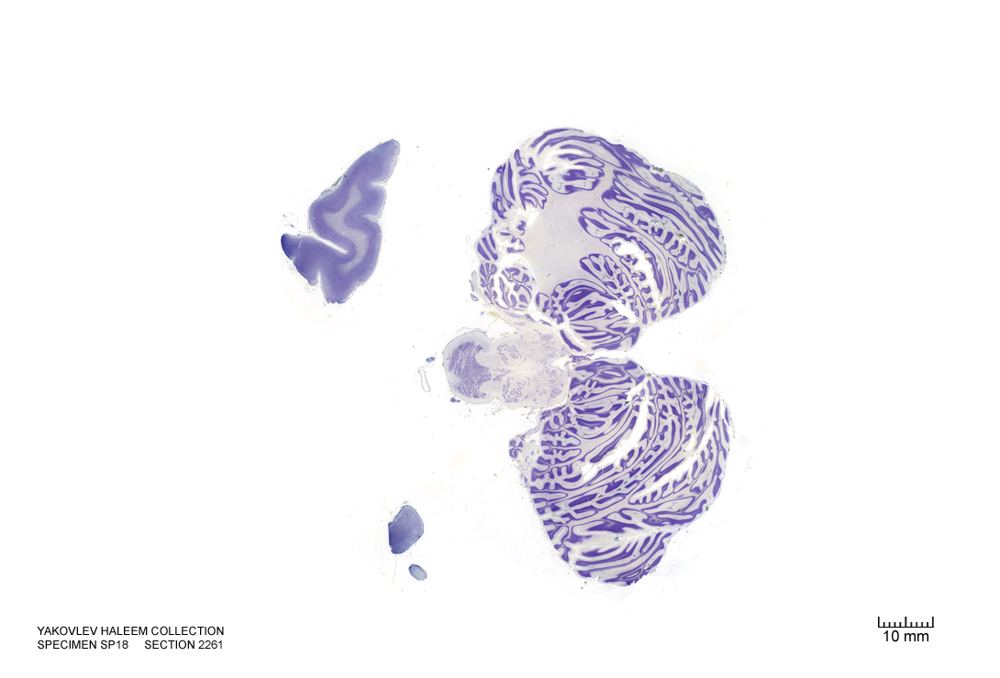
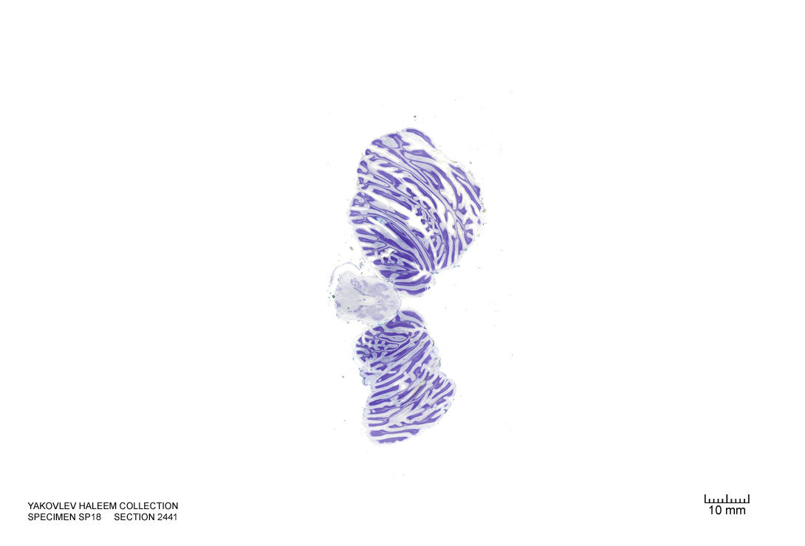

#  The Telencephalon

In this laboratory session, we will study the anatomy of the human telencephalon. The cerebrum or telencephalon is a large part of the brain containing the cerebral cortex (of the two cerebral hemispheres), as well as several subcortical structures, including the hippocampus, basal ganglia, and olfactory bulb. In the human brain, the cerebrum is the uppermost region of the central nervous system. The prosencephalon or forebrain is the embryonic structure from which the cerebrum develops prenatally. In mammals, the dorsal telencephalon, or pallium, develops into the cerebral cortex, and the ventral telencephalon, or subpallium, becomes the basal ganglia. The cerebrum is also divided into approximately symmetric left and right cerebral hemispheres.

Below, you will be presented with a number of figures and asked to label or color certain structures in each figure.

## A Series Of Coronal Sections Of A Human Brain 

In Figure \@ref(fig:1520), label the following structures:

1. The cingulate sulcus
1. The cingulate gyrus
1. The corpus callosum
1. The lateral ventricle
1. The caudate nucleus
1. The insula
1. The lateral sulcus
1. The superior temporal gyrus
1. The superior temporal sulcus
1. The middle temporal gyrus
1. The middle temporal sulcus
1. The inferior temporal gyrus
1. The inferior temporal sulcus
1. The putamen
1. The nucleus accumbens
1. The optic nerves (left and right)
1. The septum pelucidum
1. The septal nuclei
1. The internal capsule
1. The external capsule
1. The entorhinal cortex
1. The parahippocampal gyrus

(ref:c1520) Coronal section from [The Human Brain Atlas](https://msu.edu/~brains/brains/human/index.html) at the [Michigan State University Brain Biodiveristy Bank](https://msu.edu/~brains/copyright.html) which [acknowledges](https://msu.edu/~brains/copyright.html) their support from the National Science Foundation. 

```{r 1520, fig.cap='(ref:c1520)', echo=FALSE, message=FALSE, warning=FALSE}
knitr::include_graphics("./figures/cns/1520_cell.jpg")
```

In Figure \@ref(fig:1680), label the following structures:

1. The cingulate sulcus
1. The cingulate gyrus
1. The corpus callosum
1. The fornix 
1. The lateral ventricle
1. The choroid plexus
1. The anterior commissure
1. The insula
1. The lateral sulcus
1. The superior temporal gyrus
1. The superior temporal sulcus
1. The middle temporal gyrus
1. The middle temporal sulcus
1. The inferior temporal gyrus
1. The inferior temporal sulcus
1. The putamen
1. The preoptic area
1. The optic chiasm
1. The infundibular stalk
1. A pigment epithelial cell with extended proces
1. The 3^d^ ventricle
1. The internal capsule
1. The external capsule
1. The claustrum
1. The globus pallidus
1. The anterior commissure
1. The amygdala
1. The entorhinal cortex
1. The parahippocampal gyrus


(ref:c1680) Coronal section from [The Human Brain Atlas](https://msu.edu/~brains/brains/human/index.html) at the [Michigan State University Brain Biodiveristy Bank](https://msu.edu/~brains/copyright.html) which [acknowledges](https://msu.edu/~brains/copyright.html) their support from the National Science Foundation. 


```{r 1680, fig.cap='(ref:c1680)', echo=FALSE, message=FALSE, warning=FALSE}
knitr::include_graphics("./figures/cns/1680_cell.jpg")
```

In Figure \@ref(fig:`1840`), label the following structures:

1. The cingulate sulcus
1. The cingulate gyrus
1. The corpus callosum
1. The fornix 
1. The lateral ventricle
1. The choroid plexus
1. The caudate nucleus
1. The thalamus
1. The insula
1. The lateral sulcus
1. The superior temporal gyrus
1. The superior temporal sulcus
1. The middle temporal gyrus
1. The middle temporal sulcus
1. The inferior temporal gyrus
1. The inferior temporal sulcus
1. The putamen
1. The hippocampus
1. The 3^d^ ventricle
1. The internal capsule
1. The external capsule
1. The claustrum
1. The globus pallidus
1. The fornix
1. The optic tract
1. The hypothalamus
1. The lateral ventricle
1. The entorhinal cortex
1. The parahippocampal gyrus
1. The amygdaloid nuclei:
   * medial
   * central
   * cortical
   * basomedial
   * basolateral
   * lateral


(ref:c1840) Coronal section from [The Human Brain Atlas](https://msu.edu/~brains/brains/human/index.html) at the [Michigan State University Brain Biodiveristy Bank](https://msu.edu/~brains/copyright.html) which [acknowledges](https://msu.edu/~brains/copyright.html) their support from the National Science Foundation. 


```{r 1840, fig.cap='(ref:c1840)', echo=FALSE, message=FALSE, warning=FALSE}
knitr::include_graphics("./figures/cns/1840_cell.jpg")
```

In Figure \@ref(fig:2000), label the following structures:


(ref:c2000) Coronal section from [The Human Brain Atlas](https://msu.edu/~brains/brains/human/index.html) at the [Michigan State University Brain Biodiveristy Bank](https://msu.edu/~brains/copyright.html) which [acknowledges](https://msu.edu/~brains/copyright.html) their support from the National Science Foundation. 

1. The cingulate sulcus
1. The cingulate gyrus
1. The corpus callosum
1. The fornix 
1. The lateral ventricle
1. The choroid plexus
1. The caudate nucleus
1. The thalamus
1. The insula
1. The lateral sulcus
1. The superior temporal gyrus
1. The superior temporal sulcus
1. The middle temporal gyrus
1. The middle temporal sulcus
1. The inferior temporal gyrus
1. The inferior temporal sulcus
1. The putamen
1. The hippocampus
1. The dentate gyrus
1. The zona incerta
1. The substantia nigra
1. The 3^d^ ventricle
1. The thalamus
1. The internal capsule
1. The external capsule
1. The claustrum
1. The globus pallidus
1. The optic tract
1. The lateral ventricle
1. The subthalamic nucleus
1. The entorhinal cortex
1. The parahippocampal gyrus
1. The cerebral peduncle


```{r 2000, fig.cap='(ref:c2000)', echo=FALSE, message=FALSE, warning=FALSE}
knitr::include_graphics("./figures/cns/2000_cell.jpg")
```

In Figure \@ref(fig:2060), label the following structures:

1. The cingulate gyrus
1. The corpus callosum
1. The fornix 
1. The lateral ventricle
1. The choroid plexus
1. The caudate nucleus
1. The thalamus
1. The insula
1. The lateral sulcus
1. The superior temporal gyrus
1. The superior temporal sulcus
1. The middle temporal gyrus
1. The middle temporal sulcus
1. The inferior temporal gyrus
1. The inferior temporal sulcus
1. The putamen
1. The hippocampus
1. The dentate gyrus
1. The red nucleus
1. The substantia nigra
1. The 3^d^ ventricle
1. The thalamus
1. The internal capsule
1. The external capsule
1. The pons
1. The zona incerta
1. The globus pallidus
1. The optic tract
1. The lateral ventricle
1. The subthalamic nucleus
1. The entorhinal cortex
1. The parahippocampal gyrus
1. The cerebral peduncle

(ref:c2060) Coronal section from [The Human Brain Atlas](https://msu.edu/~brains/brains/human/index.html) at the [Michigan State University Brain Biodiveristy Bank](https://msu.edu/~brains/copyright.html) which [acknowledges](https://msu.edu/~brains/copyright.html) their support from the National Science Foundation. 


```{r 2060, fig.cap='(ref:c2060)', echo=FALSE, message=FALSE, warning=FALSE}
knitr::include_graphics("./figures/cns/2060_cell.jpg")
```

In Figure \@ref(fig:2240), label the following structures:

1. The cingulate gyrus
1. The corpus callosum
1. The fornix 
1. The lateral ventricle
1. The choroid plexus
1. The caudate nucleus
1. The insula
1. The lateral sulcus
1. The superior temporal gyrus
1. The superior temporal sulcus
1. The middle temporal gyrus
1. The middle temporal sulcus
1. The inferior temporal gyrus
1. The inferior temporal sulcus
1. The putamen
1. The hippocampus
1. The dentate gyrus
1. The red nucleus
1. The substantia nigra
1. The decussation of the superior cerebellar peduncle
1. The habenula
1. The pineal gland
1. The medial geniculate nucleus
1. The lateral geniculate nucleus
1. The cerebral peduncle
1. The lateral ventricle
1. The entorhinal cortex
1. The parahippocampal gyrus
1. The posterior commissure
1. The cerebral aqueduct
1. The pons

(ref:c2240) Coronal section from [The Human Brain Atlas](https://msu.edu/~brains/brains/human/index.html) at the [Michigan State University Brain Biodiveristy Bank](https://msu.edu/~brains/copyright.html) which [acknowledges](https://msu.edu/~brains/copyright.html) their support from the National Science Foundation. 


```{r 2240, fig.cap='(ref:c2240)', echo=FALSE, message=FALSE, warning=FALSE}
knitr::include_graphics("./figures/cns/2240_cell.jpg")
```

In Figure \@ref(fig:2390), label the following structures:

1. The cingulate gyrus
1. The corpus callosum
1. The fornix 
1. The lateral ventricle
1. The choroid plexus
1. The caudate nucleus
1. The thalamus
1. The insula
1. The lateral sulcus
1. The superior temporal gyrus
1. The superior temporal sulcus
1. The middle temporal gyrus
1. The middle temporal sulcus
1. The inferior temporal gyrus
1. The inferior temporal sulcus
1. The putamen
1. The hippocampus
1. The dentate gyrus
1. The pineal gland
1. The periaqueductal grey matter
1. The superior cerebellar peduncle
1. The cerebral aqueduct
1. The pulvinar
1. The superior colliculus
1. The lateral ventricle
1. The oculomotor nucleus
1. The medial longitudinal fasciculus
1. The parahippocampal gyrus
1. The cerebellum
1. The pons
1. The pyramidal tract


(ref:c2390) Coronal section from [The Human Brain Atlas](https://msu.edu/~brains/brains/human/index.html) at the [Michigan State University Brain Biodiveristy Bank](https://msu.edu/~brains/copyright.html) which [acknowledges](https://msu.edu/~brains/copyright.html) their support from the National Science Foundation. 


```{r 2390, fig.cap='(ref:c2390)', echo=FALSE, message=FALSE, warning=FALSE}
knitr::include_graphics("./figures/cns/2390_cell.jpg")
```

In Figure \@ref(fig:2500), label the following structures:

1. The cingulate gyrus
1. The corpus callosum
1. The fornix 
1. The choroid plexus
1. The caudate nucleus
1. The insula
1. The lateral sulcus
1. The middle temporal gyrus
1. The middle temporal sulcus
1. The inferior temporal gyrus
1. The inferior temporal sulcus
1. The hippocampus
1. The dentate gyrus
1. The superior cerebellar peduncle
1. The inferior olive
1. The 4^th^ ventricle
1. The lateral ventricle
1. The inferior colliculus
1. The parahippocampal gyrus
1. The medial longitudinal fasciculus
1. The cerebellum
1. The middle cerebellar peduncle
1. The pontine reticular formation


(ref:c2500) Coronal section from [The Human Brain Atlas](https://msu.edu/~brains/brains/human/index.html) at the [Michigan State University Brain Biodiveristy Bank](https://msu.edu/~brains/copyright.html) which [acknowledges](https://msu.edu/~brains/copyright.html) their support from the National Science Foundation. 


```{r 2500, fig.cap='(ref:c2500)', echo=FALSE, message=FALSE, warning=FALSE}
knitr::include_graphics("./figures/cns/2500_cell.jpg")
```

In Figure \@ref(fig:2660), label the following structures:

1. The dentate gyrus
1. The medial vestibular nucleus
1. The nucleus of the solitary tract
1. The solitary tract
1. The lateral ventricle
1. The 4^th^ ventricle
1. The inferior cerebellar peduncle
1. The inferior olive

(ref:c2660) Coronal section from [The Human Brain Atlas](https://msu.edu/~brains/brains/human/index.html) at the [Michigan State University Brain Biodiveristy Bank](https://msu.edu/~brains/copyright.html) which [acknowledges](https://msu.edu/~brains/copyright.html) their support from the National Science Foundation. 


```{r 2660, fig.cap='(ref:c2660)', echo=FALSE, message=FALSE, warning=FALSE}
knitr::include_graphics("./figures/cns/2660_cell.jpg")
```

In Figure \@ref(fig:2800), label the following structures:

1. The lateral ventricle
1. The vermis
1. The cerebellum
1. The inferior olive
1. The spinal cord


(ref:c2800) Coronal section from [The Human Brain Atlas](https://msu.edu/~brains/brains/human/index.html) at the [Michigan State University Brain Biodiveristy Bank](https://msu.edu/~brains/copyright.html) which [acknowledges](https://msu.edu/~brains/copyright.html) their support from the National Science Foundation. 


```{r 2800, fig.cap='(ref:c2800)', echo=FALSE, message=FALSE, warning=FALSE}
knitr::include_graphics("./figures/cns/2800_cell.jpg")
```

In Figure \@ref(fig:3270), label the following structures:

1. The calcarine sulcus
1. The striate cortex (primary visual cortex)
1. The vermis
1. The cerebellum
1. The spinal cord:
   * dorsal horn
   * ventral horn
   * dorsal column
   * lateral column
   * ventral column


(ref:c3270) Coronal section from [The Human Brain Atlas](https://msu.edu/~brains/brains/human/index.html) at the [Michigan State University Brain Biodiveristy Bank](https://msu.edu/~brains/copyright.html) which [acknowledges](https://msu.edu/~brains/copyright.html) their support from the National Science Foundation. 


```{r 3270, fig.cap='(ref:c3270)', echo=FALSE, message=FALSE, warning=FALSE}
knitr::include_graphics("./figures/cns/3270_cell.jpg")
```

##  A Series Of Sagittal Sections Of A Human Brain  

In Figure \@ref(fig:1492), label the following structures:

1. The lateral sulcus 
1. The superior temporal sulcus
1. The middle temporal sulcus

(ref:s1492) Sagittal section from [The Human Brain Atlas](https://msu.edu/~brains/brains/human/index.html) at the [Michigan State University Brain Biodiveristy Bank](https://msu.edu/~brains/copyright.html) which [acknowledges](https://msu.edu/~brains/copyright.html) their support from the National Science Foundation. 

```{r 1492, fig.cap='(ref:s1492)', echo=FALSE, message=FALSE, warning=FALSE}
knitr::include_graphics("./figures/cns/1492_cell.jpg")
```

In Figure \@ref(fig:1392), label the following structures:

1. The lateral sulcus 
1. The superior temporal gyrus
1. The superior temporal sulcus
1. The middle temporal sulcus
1. The inferior temporal sulcus
1. The inferior temporal gyrus
1. The central sulcus
1. The precentral gyrus
1. The postcentral gyrus

(ref:s1392) Sagittal section from [The Human Brain Atlas](https://msu.edu/~brains/brains/human/index.html) at the [Michigan State University Brain Biodiveristy Bank](https://msu.edu/~brains/copyright.html) which [acknowledges](https://msu.edu/~brains/copyright.html) their support from the National Science Foundation. 

```{r 1392, fig.cap='(ref:s1392)', echo=FALSE, message=FALSE, warning=FALSE}

```


In Figure \@ref(fig:1232), label the following structures:

1. The middle frontal gyrus
1. The inferior frontal sulcus
1. The inferior frontal gyrus
  * oprecular part
  * triangular part
  * orbital part
1. The lateral sulcus 
1. The superior temporal gyrus
1. The superior temporal sulcus
1. The middle temporal sulcus
1. The inferior temporal sulcus
1. The inferior temporal gyrus
1. The precentral sulcus
1. The precentral gyrus
1. The central sulcus
1. The postcentral gyrus
1. The postcentral sulcus
1. The transverse tremporal sulci
1. Heschl's gyrus


(ref:1232) Sagittal section from [The Human Brain Atlas](https://msu.edu/~brains/brains/human/index.html) at the [Michigan State University Brain Biodiveristy Bank](https://msu.edu/~brains/copyright.html) which [acknowledges](https://msu.edu/~brains/copyright.html) their support from the National Science Foundation. 

```{r 1232, fig.cap='(ref:s1232)', echo=FALSE, message=FALSE, warning=FALSE}

```

In Figure \@ref(fig:1022), label the following structures:

1. The insula
1. The  lateral sulcus
1. The cerebellum

(ref:s1022) Sagittal section from [The Human Brain Atlas](https://msu.edu/~brains/brains/human/index.html) at the [Michigan State University Brain Biodiveristy Bank](https://msu.edu/~brains/copyright.html) which [acknowledges](https://msu.edu/~brains/copyright.html) their support from the National Science Foundation. 

```{r 1022, fig.cap='(ref:s1022)', echo=FALSE, message=FALSE, warning=FALSE}

```


In Figure \@ref(fig:902), label the following structures:

1. The insula
1. The claustrum
1. The tail of the caudate nucleus
1. The hippocampus
1. The  lateral ventricle
1. The cerebellum

(ref:s902) Sagittal section from [The Human Brain Atlas](https://msu.edu/~brains/brains/human/index.html) at the [Michigan State University Brain Biodiveristy Bank](https://msu.edu/~brains/copyright.html) which [acknowledges](https://msu.edu/~brains/copyright.html) their support from the National Science Foundation. 

```{r 902, fig.cap='(ref:s902)', echo=FALSE, message=FALSE, warning=FALSE}

```


In Figure \@ref(fig:842), label the following structures:

1. The external capsule
1. The internal capsule
1. The claustrum
1. The putamen
1. The anterior commissure
1. The tail of the caudate nucleus
1. The hippocampus
1. The dentate gyrus
1. The cerebellum

(ref:s842) Sagittal section from [The Human Brain Atlas](https://msu.edu/~brains/brains/human/index.html) at the [Michigan State University Brain Biodiveristy Bank](https://msu.edu/~brains/copyright.html) which [acknowledges](https://msu.edu/~brains/copyright.html) their support from the National Science Foundation. 

```{r 842, fig.cap='(ref:s842)', echo=FALSE, message=FALSE, warning=FALSE}
knitr::include_graphics("./figures/cns/0842_cell.jpg")
```


In Figure \@ref(fig:782), label the following structures:

1. The external capsule
1. The internal capsule
1. The claustrum
1. The putamen
1. The anterior commissure
1. The amygdala
1. The optic tract
1. The tail of the caudate nucleus
1. The hippocampus
1. The dentate gyrus
1. The cerebellum

(ref:s782) Sagittal section from [The Human Brain Atlas](https://msu.edu/~brains/brains/human/index.html) at the [Michigan State University Brain Biodiveristy Bank](https://msu.edu/~brains/copyright.html) which [acknowledges](https://msu.edu/~brains/copyright.html) their support from the National Science Foundation. 

```{r 782, fig.cap='(ref:s782)', echo=FALSE, message=FALSE, warning=FALSE}
knitr::include_graphics("./figures/cns/0782_cell.jpg")
```


In Figure \@ref(fig:722), label the following structures:

1. The external capsule
1. The internal capsule
1. The claustrum
1. The putamen
1. The anterior commissure
1. The amygdala
1. The optic tract
1. The lateral geniculate nucleus
1. The tail of the caudate nucleus
1. The hippocampus
1. The dentate gyrus
1. The cerebellum

(ref:s722) Sagittal section from [The Human Brain Atlas](https://msu.edu/~brains/brains/human/index.html) at the [Michigan State University Brain Biodiveristy Bank](https://msu.edu/~brains/copyright.html) which [acknowledges](https://msu.edu/~brains/copyright.html) their support from the National Science Foundation. 

```{r 722, fig.cap='(ref:s722)', echo=FALSE, message=FALSE, warning=FALSE}
knitr::include_graphics("./figures/cns/0722_cell.jpg")
```


In Figure \@ref(fig:572), label the following structures:

1. The thalamic nuclei
  * pulvinar
  * ventral group
  * medial geniculate nucleus
1. The internal capsule
1. The claustrum
1. The putamen
1. The anterior commissure
1. The amygdala
1. The optic tract
1. The lateral geniculate nucleus
1. The ventral pallidum
1. The cerebral peduncle
1. The superior temporal gyrus
1. The caudate nucleus
1. The hippocampus
1. The middle cerebellar peduncle
1. The cerebellum
1. The brachium of the superior colliculus
1. The corpus callosum
1. The fornix
1. The superior frontal gyrus
1. The lateral ventricle

(ref:572) Sagittal section from [The Human Brain Atlas](https://msu.edu/~brains/brains/human/index.html) at the [Michigan State University Brain Biodiveristy Bank](https://msu.edu/~brains/copyright.html) which [acknowledges](https://msu.edu/~brains/copyright.html) their support from the National Science Foundation. 

```{r 572, fig.cap='(ref:s572)', echo=FALSE, message=FALSE, warning=FALSE}
knitr::include_graphics("./figures/cns/0572_cell.jpg")
```


In Figure \@ref(fig:512), label the following structures:

1. The thalamic nuclei
  * pulvinar
  * ventral group
  * medial geniculate nucleus
1. The internal capsule
1. The globus pallidus
1. The ventral striatum
1. The anterior commissure
1. The amygdala
1. The optic tract
1. The lateral geniculate nucleus
1. The ventral pallidum
1. The cerebral peduncle
1. The superior temporal gyrus
1. The caudate nucleus
1. The hippocampus
1. The middle cerebellar peduncle
1. The cerebellum
1. The parieto-occipital sulcus
1. The brachium of the superior colliculus
1. The corpus callosum
1. The fornix
1. The superior frontal gyrus
1. The lateral ventricle

(ref:s512) Sagittal section from [The Human Brain Atlas](https://msu.edu/~brains/brains/human/index.html) at the [Michigan State University Brain Biodiveristy Bank](https://msu.edu/~brains/copyright.html) which [acknowledges](https://msu.edu/~brains/copyright.html) their support from the National Science Foundation. 

```{r 512, fig.cap='(ref:s512)', echo=FALSE, message=FALSE, warning=FALSE}
knitr::include_graphics("./figures/cns/0512_cell.jpg")
```


In Figure \@ref(fig:452), label the following structures:

1. The superior frontal gyrus
1. The thalamic nuclei
  * pulvinar
1. The globus pallidus
1. The ventral striatum
1. The anterior commissure
1. The medial geniculate nucleus
1. The optic tract
1. The lateral geniculate nucleus
1. The ventral pallidum
1. The middle cerebellar peduncle
1. The substantia nigra
1. The cerebral peduncle
1. The subthalamic nucleus
1. The cerebellum
1. The parieto-occipital sulcus
1. The brachium of the superior colliculus
1. The corpus callosum
1. The fornix
1. The lateral ventricle
1. The dentate nucleus


(ref:s452) Sagittal section from [The Human Brain Atlas](https://msu.edu/~brains/brains/human/index.html) at the [Michigan State University Brain Biodiveristy Bank](https://msu.edu/~brains/copyright.html) which [acknowledges](https://msu.edu/~brains/copyright.html) their support from the National Science Foundation. 

```{r 452, fig.cap='(ref:s452)', echo=FALSE, message=FALSE, warning=FALSE}
knitr::include_graphics("./figures/cns/0452_cell.jpg")
```


In Figure \@ref(fig:392), label the following structures:

1. The corpus callosum
  * the splenium
  * the body
1. The thalamic nuclei
  * pulvinar
  * ventral group
  * centromedian gropup
1. The anterior commissure
1. The optic tract
1. The caudate nucleus
1. The middle cerebellar peduncle
1. The cerebellum
1. The fornix
1. The superior frontal gyrus
1. The lateral ventricle
1. The parieto-occipital sulcus
1. The brachium of the superior colliculus
1. The brachium of the inferior colliculus
1. The dentate nucleus
1. The subthalamic nucleus

(ref:s392) Sagittal section from [The Human Brain Atlas](https://msu.edu/~brains/brains/human/index.html) at the [Michigan State University Brain Biodiveristy Bank](https://msu.edu/~brains/copyright.html) which [acknowledges](https://msu.edu/~brains/copyright.html) their support from the National Science Foundation. 

```{r 392, fig.cap='(ref:s392)', echo=FALSE, message=FALSE, warning=FALSE}
knitr::include_graphics("./figures/cns/0392_cell.jpg")
```


In Figure \@ref(fig:332), label the following structures:

1. The corpus callosum
  * the splenium
  * the body
1. The thalamic nuclei
  * anterior group
  * ventral group
  * centromedian gropup
1. The anterior commissure
1. The hypothalamus
1. The red nucleus
1. The substantia nigra
1. The cerebral peduncle
1. The superior colliculus
1. The pontine nuclei
1. The optic tract
1. The caudate nucleus
1. The middle cerebellar peduncle
1. The cerebellum
1. The fornix
1. The precuneus
1. The cuneus
1. The fornix
1. The lateral ventricle
1. The parieto-occipital sulcus
1. The dentate nucleus
1. The cerebellum
1. The inferior cerebellar peduncle


(ref:s332) Sagittal section from [The Human Brain Atlas](https://msu.edu/~brains/brains/human/index.html) at the [Michigan State University Brain Biodiveristy Bank](https://msu.edu/~brains/copyright.html) which [acknowledges](https://msu.edu/~brains/copyright.html) their support from the National Science Foundation. 

```{r 332, fig.cap='(ref:s332)', echo=FALSE, message=FALSE, warning=FALSE}
knitr::include_graphics("./figures/cns/0332_cell.jpg")
```


In Figure \@ref(fig:302), label the following structures:

1. The corpus callosum
  * the splenium
  * the body
  * the genu
1. The thalamus 
1. The anterior commissure
1. The mammillothalamic tract
1. The hypothalamus
1. The red nucleus
1. The substantia nigra
1. The cerebral peduncle
1. The superior colliculus
1. The inferior colliculus
1. The lateral lemniscus
1. The pontine nuclei
1. The inferior cerebellar peduncle
1. The cerebellum
1. The fornix
1. The precuneus
1. The cuneus
1. The fornix
1. The lateral ventricle
1. The parieto-occipital sulcus
1. The dentate nucleus
1. The lingual gyrus
1. The calcarine sulcus
1. The cingulate sulcus
1. The cingulate gyrus
1. The cerebellum

(ref:s302) Sagittal section from [The Human Brain Atlas](https://msu.edu/~brains/brains/human/index.html) at the [Michigan State University Brain Biodiveristy Bank](https://msu.edu/~brains/copyright.html) which [acknowledges](https://msu.edu/~brains/copyright.html) their support from the National Science Foundation. 

```{r 302, fig.cap='(ref:s302)', echo=FALSE, message=FALSE, warning=FALSE}
knitr::include_graphics("./figures/cns/0302_cell.jpg")
```


In Figure \@ref(fig:272), label the following structures:

1. The superior frontal gyrus
1. The corpus callosum
  * the splenium
  * the body
  * the genu
1. The thalamus 
1. The anterior commissure
1. The mammillothalamic tract
1. The hypothalamus
1. The red nucleus
1. The substantia nigra
1. The cerebral peduncle
1. The superior colliculus
1. The inferior colliculus
1. The lateral lemniscus
1. The pontine nuclei
1. The superior cerebellar peduncle
1. The inferior cerebellar peduncle
1. The cerebellum
1. The fornix
1. The precuneus
1. The cuneus
1. The fornix
1. The lateral ventricle
1. The parieto-occipital sulcus
1. The dentate nucleus
1. The lingual gyrus
1. The calcarine sulcus
1. The cingulate sulcus
1. The cingulate gyrus
1. The cerebellum

(ref:s272) Sagittal section from [The Human Brain Atlas](https://msu.edu/~brains/brains/human/index.html) at the [Michigan State University Brain Biodiveristy Bank](https://msu.edu/~brains/copyright.html) which [acknowledges](https://msu.edu/~brains/copyright.html) their support from the National Science Foundation. 

```{r 272, fig.cap='(ref:s272)', echo=FALSE, message=FALSE, warning=FALSE}

```


In Figure \@ref(fig:242), label the following structures:

1. The superior frontal gyrus
1. The corpus callosum
  * the splenium
  * the body
  * the genu
1. The thalamus 
1. The anterior commissure
1. The mammillothalamic tract
1. The hypothalamus
1. The red nucleus
1. The substantia nigra
1. The cerebral peduncle
1. The superior colliculus
1. The inferior colliculus
1. The lateral lemniscus
1. The pontine nuclei
1. The inferior olive
1. The cerebellar tonsil
1. The superior cerebellar peduncle
1. The inferior cerebellar peduncle
1. The cerebellum
1. The fornix
1. The precuneus
1. The cuneus
1. The fornix
1. The lateral ventricle
1. The parieto-occipital sulcus
1. The lingual gyrus
1. The calcarine sulcus
1. The cingulate sulcus
1. The cingulate gyrus
1. The cerebellum


(ref:s242) Sagittal section from [The Human Brain Atlas](https://msu.edu/~brains/brains/human/index.html) at the [Michigan State University Brain Biodiveristy Bank](https://msu.edu/~brains/copyright.html) which [acknowledges](https://msu.edu/~brains/copyright.html) their support from the National Science Foundation. 

```{r 242, fig.cap='(ref:s242)', echo=FALSE, message=FALSE, warning=FALSE}
knitr::include_graphics("./figures/cns/0242_cell.jpg")
```


In Figure \@ref(fig:212), label the following structures:

1. The corpus callosum
  * the splenium
  * the body
  * the genu
1. The thalamus 
1. The anterior commissure
1. The mammillothalamic tract
1. The hypothalamus
1. The red nucleus
1. The cerebral peduncle
1. The superior colliculus
1. The inferior colliculus
1. The pontine nuclei
1. The inferior olive
1. The cerebellar tonsil
1. The superior cerebellar peduncle
1. The cerebellum
1. The fornix
1. The precuneus
1. The cuneus
1. The fornix
1. The lateral ventricle
1. The parieto-occipital sulcus
1. The lingual gyrus
1. The calcarine sulcus
1. The cingulate sulcus
1. The cingulate gyrus
1. The cerebellum


(ref:s212) Sagittal section from [The Human Brain Atlas](https://msu.edu/~brains/brains/human/index.html) at the [Michigan State University Brain Biodiveristy Bank](https://msu.edu/~brains/copyright.html) which [acknowledges](https://msu.edu/~brains/copyright.html) their support from the National Science Foundation. 

```{r 212, fig.cap='(ref:s212)', echo=FALSE, message=FALSE, warning=FALSE}
knitr::include_graphics("./figures/cns/0212_cell.jpg")
```


In Figure \@ref(fig:182), label the following structures:

1. The corpus callosum
  * the splenium
  * the body
  * the genu
1. The thalamus 
1. The anterior commissure
1. The optic chiasm
1. The lamina terminalis
1. The mammillothalamic tract
1. The mammillariy nuclei
1. The hypothalamus
1. The red nucleus
1. The cerebral peduncle
1. The superior colliculus
1. The inferior colliculus
1. The pontine nuclei
1. The inferior olive
1. The cerebellar tonsil
1. The decussation of the superior cerebellar peduncle
1. The cerebellum
1. The fornix
1. The habenular commissure
1. The septum lucidum
1. The periaqueductal grey matter
1. The precuneus
1. The cuneus
1. The fornix
1. The lateral ventricle
1. The parieto-occipital sulcus
1. The lingual gyrus
1. The calcarine sulcus
1. The cingulate sulcus
1. The cingulate gyrus
1. The cerebellum

(ref:s182) Sagittal section from [The Human Brain Atlas](https://msu.edu/~brains/brains/human/index.html) at the [Michigan State University Brain Biodiveristy Bank](https://msu.edu/~brains/copyright.html) which [acknowledges](https://msu.edu/~brains/copyright.html) their support from the National Science Foundation. 

```{r 182, fig.cap='(ref:s182)', echo=FALSE, message=FALSE, warning=FALSE}
knitr::include_graphics("./figures/cns/0182_cell.jpg")
```

In Figure \@ref(fig:152), label the following structures:

1. The corpus callosum
  * the splenium
  * the body
  * the genu
1. The thalamus 
1. The anterior commissure
1. The optic chiasm
1. The lamina terminalis
1. The mammillothalamic tract
1. The mammillariy nuclei
1. The hypothalamus
1. The red nucleus
1. The cerebral peduncle
1. The superior colliculus
1. The inferior colliculus
1. The pontine nuclei
1. The inferior olive
1. The cerebellar tonsil
1. The decussation of the superior cerebellar peduncle
1. The cerebellum
1. The fornix
1. The habenular commissure
1. The septum lucidum
1. The periaqueductal grey matter
1. The precuneus
1. The cuneus
1. The fornix
1. The lateral ventricle
1. The parieto-occipital sulcus
1. The gracile nucleus
1. The cuneate fasciculus
1. The 4^th^ ventricle
1. The lingual gyrus
1. The calcarine sulcus
1. The cingulate sulcus
1. The cingulate gyrus
1. The cerebellum
1. The cerebral aqueduct
1. The posterior commissure
1. The habenular commissure

(ref:s152) Sagittal section from [The Human Brain Atlas](https://msu.edu/~brains/brains/human/index.html) at the [Michigan State University Brain Biodiveristy Bank](https://msu.edu/~brains/copyright.html) which [acknowledges](https://msu.edu/~brains/copyright.html) their support from the National Science Foundation. 

```{r 152, fig.cap='(ref:s182)', echo=FALSE, message=FALSE, warning=FALSE}
knitr::include_graphics("./figures/cns/0182_cell.jpg")
```

##  A Series Of Horizontal Sections Of A Human Brain  

In Figure \@ref(fig:800), label the following structures:


(ref:h800) Horizontal section from [The Human Brain Atlas](https://msu.edu/~brains/brains/human/index.html) at the [Michigan State University Brain Biodiveristy Bank](https://msu.edu/~brains/copyright.html) which [acknowledges](https://msu.edu/~brains/copyright.html) their support from the National Science Foundation. 

```{r 800, fig.cap='(ref:h800)', echo=FALSE, message=FALSE, warning=FALSE}

```

In Figure \@ref(fig:940), label the following structures:


(ref:h940) Horizontal section from [The Human Brain Atlas](https://msu.edu/~brains/brains/human/index.html) at the [Michigan State University Brain Biodiveristy Bank](https://msu.edu/~brains/copyright.html) which [acknowledges](https://msu.edu/~brains/copyright.html) their support from the National Science Foundation. 

```{r 940, fig.cap='(ref:h940)', echo=FALSE, message=FALSE, warning=FALSE}

```

In Figure \@ref(fig:1000), label the following structures:


(ref:h1000) Horizontal section from [The Human Brain Atlas](https://msu.edu/~brains/brains/human/index.html) at the [Michigan State University Brain Biodiveristy Bank](https://msu.edu/~brains/copyright.html) which [acknowledges](https://msu.edu/~brains/copyright.html) their support from the National Science Foundation. 

```{r 1000, fig.cap='(ref:h1000)', echo=FALSE, message=FALSE, warning=FALSE}
knitr::include_graphics("./figures/cns/horizontal/1000_cell.jpg")
```

In Figure \@ref(fig:1100), label the following structures:


(ref:h1100) Horizontal section from [The Human Brain Atlas](https://msu.edu/~brains/brains/human/index.html) at the [Michigan State University Brain Biodiveristy Bank](https://msu.edu/~brains/copyright.html) which [acknowledges](https://msu.edu/~brains/copyright.html) their support from the National Science Foundation. 

```{r 1100, fig.cap='(ref:h11100)', echo=FALSE, message=FALSE, warning=FALSE}

```

In Figure \@ref(fig:1200), label the following structures:


(ref:h1200) Horizontal section from [The Human Brain Atlas](https://msu.edu/~brains/brains/human/index.html) at the [Michigan State University Brain Biodiveristy Bank](https://msu.edu/~brains/copyright.html) which [acknowledges](https://msu.edu/~brains/copyright.html) their support from the National Science Foundation. 

```{r 1200, fig.cap='(ref:h1200)', echo=FALSE, message=FALSE, warning=FALSE}
knitr::include_graphics("./figures/cns/horizontal/1200_cell.jpg")
```

In Figure \@ref(fig:1300), label the following structures:


(ref:h1300) Horizontal section from [The Human Brain Atlas](https://msu.edu/~brains/brains/human/index.html) at the [Michigan State University Brain Biodiveristy Bank](https://msu.edu/~brains/copyright.html) which [acknowledges](https://msu.edu/~brains/copyright.html) their support from the National Science Foundation. 

```{r 1300, fig.cap='(ref:h1300)', echo=FALSE, message=FALSE, warning=FALSE}
knitr::include_graphics("./figures/cns/horizontal/1300_cell.jpg")
```

In Figure \@ref(fig:1400), label the following structures:


(ref:h1400) Horizontal section from [The Human Brain Atlas](https://msu.edu/~brains/brains/human/index.html) at the [Michigan State University Brain Biodiveristy Bank](https://msu.edu/~brains/copyright.html) which [acknowledges](https://msu.edu/~brains/copyright.html) their support from the National Science Foundation. 

```{r 1400, fig.cap='(ref:h1400)', echo=FALSE, message=FALSE, warning=FALSE}
knitr::include_graphics("./figures/cns/horizontal/1400_cell.jpg")
```

In Figure \@ref(fig:1500), label the following structures:


(ref:h1500) Horizontal section from [The Human Brain Atlas](https://msu.edu/~brains/brains/human/index.html) at the [Michigan State University Brain Biodiveristy Bank](https://msu.edu/~brains/copyright.html) which [acknowledges](https://msu.edu/~brains/copyright.html) their support from the National Science Foundation. 

```{r 1500, fig.cap='(ref:h1500)', echo=FALSE, message=FALSE, warning=FALSE}

```

In Figure \@ref(fig:1600), label the following structures:


(ref:h1600) Horizontal section from [The Human Brain Atlas](https://msu.edu/~brains/brains/human/index.html) at the [Michigan State University Brain Biodiveristy Bank](https://msu.edu/~brains/copyright.html) which [acknowledges](https://msu.edu/~brains/copyright.html) their support from the National Science Foundation. 

```{r 1600, fig.cap='(ref:h1600)', echo=FALSE, message=FALSE, warning=FALSE}
knitr::include_graphics("./figures/cns/horizontal/1600_cell.jpg")
```

In Figure \@ref(fig:1640), label the following structures:


(ref:h1640) Horizontal section from [The Human Brain Atlas](https://msu.edu/~brains/brains/human/index.html) at the [Michigan State University Brain Biodiveristy Bank](https://msu.edu/~brains/copyright.html) which [acknowledges](https://msu.edu/~brains/copyright.html) their support from the National Science Foundation. 

```{r 1640, fig.cap='(ref:h1640)', echo=FALSE, message=FALSE, warning=FALSE}
knitr::include_graphics("./figures/cns/horizontal/1640_cell.jpg")
```

In Figure \@ref(fig:1700), label the following structures:


(ref:h1700) Horizontal section from [The Human Brain Atlas](https://msu.edu/~brains/brains/human/index.html) at the [Michigan State University Brain Biodiveristy Bank](https://msu.edu/~brains/copyright.html) which [acknowledges](https://msu.edu/~brains/copyright.html) their support from the National Science Foundation. 

```{r 1700, fig.cap='(ref:h1700)', echo=FALSE, message=FALSE, warning=FALSE}
knitr::include_graphics("./figures/cns/horizontal/1700_cell.jpg")
```

In Figure \@ref(fig:1740), label the following structures:


(ref:h1740) Horizontal section from [The Human Brain Atlas](https://msu.edu/~brains/brains/human/index.html) at the [Michigan State University Brain Biodiveristy Bank](https://msu.edu/~brains/copyright.html) which [acknowledges](https://msu.edu/~brains/copyright.html) their support from the National Science Foundation. 

```{r 1740, fig.cap='(ref:h1740)', echo=FALSE, message=FALSE, warning=FALSE}
knitr::include_graphics("./figures/cns/horizontal/1740_cell.jpg")
```

In Figure \@ref(fig:1800), label the following structures:


(ref:h1800) Horizontal section from [The Human Brain Atlas](https://msu.edu/~brains/brains/human/index.html) at the [Michigan State University Brain Biodiveristy Bank](https://msu.edu/~brains/copyright.html) which [acknowledges](https://msu.edu/~brains/copyright.html) their support from the National Science Foundation. 

```{r 1800, fig.cap='(ref:h1800)', echo=FALSE, message=FALSE, warning=FALSE}
knitr::include_graphics("./figures/cns/horizontal/1800_cell.jpg")
```

In Figure \@ref(fig:ho1840), label the following structures:


(ref:h1840) Horizontal section from [The Human Brain Atlas](https://msu.edu/~brains/brains/human/index.html) at the [Michigan State University Brain Biodiveristy Bank](https://msu.edu/~brains/copyright.html) which [acknowledges](https://msu.edu/~brains/copyright.html) their support from the National Science Foundation. 

```{r ho1840, fig.cap='(ref:h1840)', echo=FALSE, message=FALSE, warning=FALSE}
knitr::include_graphics("./figures/cns/horizontal/1840_cell.jpg")
```

In Figure \@ref(fig:1900), label the following structures:


(ref:h1900) Horizontal section from [The Human Brain Atlas](https://msu.edu/~brains/brains/human/index.html) at the [Michigan State University Brain Biodiveristy Bank](https://msu.edu/~brains/copyright.html) which [acknowledges](https://msu.edu/~brains/copyright.html) their support from the National Science Foundation. 

```{r 1900, fig.cap='(ref:h1900)', echo=FALSE, message=FALSE, warning=FALSE}
knitr::include_graphics("./figures/cns/horizontal/1900_cell.jpg")
```

In Figure \@ref(fig:ho2000), label the following structures:


(ref:h2000) Horizontal section from [The Human Brain Atlas](https://msu.edu/~brains/brains/human/index.html) at the [Michigan State University Brain Biodiveristy Bank](https://msu.edu/~brains/copyright.html) which [acknowledges](https://msu.edu/~brains/copyright.html) their support from the National Science Foundation. 

```{r ho2000, fig.cap='(ref:h2000)', echo=FALSE, message=FALSE, warning=FALSE}
knitr::include_graphics("./figures/cns/horizontal/2000_cell.jpg")
```

In Figure \@ref(fig:2100), label the following structures:


(ref:h2100) Horizontal section from [The Human Brain Atlas](https://msu.edu/~brains/brains/human/index.html) at the [Michigan State University Brain Biodiveristy Bank](https://msu.edu/~brains/copyright.html) which [acknowledges](https://msu.edu/~brains/copyright.html) their support from the National Science Foundation. 

```{r 2100, fig.cap='(ref:h2100)', echo=FALSE, message=FALSE, warning=FALSE}
knitr::include_graphics("./figures/cns/horizontal/2100_cell.jpg")
```

In Figure \@ref(fig:2200), label the following structures:


(ref:h2200) Horizontal section from [The Human Brain Atlas](https://msu.edu/~brains/brains/human/index.html) at the [Michigan State University Brain Biodiveristy Bank](https://msu.edu/~brains/copyright.html) which [acknowledges](https://msu.edu/~brains/copyright.html) their support from the National Science Foundation. 

```{r 2200, fig.cap='(ref:h2200)', echo=FALSE, message=FALSE, warning=FALSE}
knitr::include_graphics("./figures/cns/horizontal/2200_cell.jpg")
```

In Figure \@ref(fig:ho2240), label the following structures:


(ref:h2240) Horizontal section from [The Human Brain Atlas](https://msu.edu/~brains/brains/human/index.html) at the [Michigan State University Brain Biodiveristy Bank](https://msu.edu/~brains/copyright.html) which [acknowledges](https://msu.edu/~brains/copyright.html) their support from the National Science Foundation. 

```{r ho2240, fig.cap='(ref:h2240)', echo=FALSE, message=FALSE, warning=FALSE}
knitr::include_graphics("./figures/cns/horizontal/2240_cell.jpg")
```

In Figure \@ref(fig:2260), label the following structures:


(ref:h2260) Horizontal section from [The Human Brain Atlas](https://msu.edu/~brains/brains/human/index.html) at the [Michigan State University Brain Biodiveristy Bank](https://msu.edu/~brains/copyright.html) which [acknowledges](https://msu.edu/~brains/copyright.html) their support from the National Science Foundation. 

```{r 2260, fig.cap='(ref:h2260)', echo=FALSE, message=FALSE, warning=FALSE}

```

In Figure \@ref(fig:2280), label the following structures:


(ref:h2280) Horizontal section from [The Human Brain Atlas](https://msu.edu/~brains/brains/human/index.html) at the [Michigan State University Brain Biodiveristy Bank](https://msu.edu/~brains/copyright.html) which [acknowledges](https://msu.edu/~brains/copyright.html) their support from the National Science Foundation. 

```{r 2280, fig.cap='(ref:h2280)', echo=FALSE, message=FALSE, warning=FALSE}
knitr::include_graphics("./figures/cns/horizontal/2280_cell.jpg")
```

In Figure \@ref(fig:2300), label the following structures:


(ref:h2300) Horizontal section from [The Human Brain Atlas](https://msu.edu/~brains/brains/human/index.html) at the [Michigan State University Brain Biodiveristy Bank](https://msu.edu/~brains/copyright.html) which [acknowledges](https://msu.edu/~brains/copyright.html) their support from the National Science Foundation. 

```{r 2300, fig.cap='(ref:h2300)', echo=FALSE, message=FALSE, warning=FALSE}
knitr::include_graphics("./figures/cns/horizontal/2300_cell.jpg")
```

In Figure \@ref(fig:2340), label the following structures:


(ref:h2340) Horizontal section from [The Human Brain Atlas](https://msu.edu/~brains/brains/human/index.html) at the [Michigan State University Brain Biodiveristy Bank](https://msu.edu/~brains/copyright.html) which [acknowledges](https://msu.edu/~brains/copyright.html) their support from the National Science Foundation. 

```{r 2340, fig.cap='(ref:h2340)', echo=FALSE, message=FALSE, warning=FALSE}
knitr::include_graphics("./figures/cns/horizontal/2340_cell.jpg")
```

In Figure \@ref(fig:2400), label the following structures:


(ref:h2400) Horizontal section from [The Human Brain Atlas](https://msu.edu/~brains/brains/human/index.html) at the [Michigan State University Brain Biodiveristy Bank](https://msu.edu/~brains/copyright.html) which [acknowledges](https://msu.edu/~brains/copyright.html) their support from the National Science Foundation. 

```{r 2400, fig.cap='(ref:h2400)', echo=FALSE, message=FALSE, warning=FALSE}
knitr::include_graphics("./figures/cns/horizontal/2400_cell.jpg")
```

In Figure \@ref(fig:2440), label the following structures:


(ref:h2440) Horizontal section from [The Human Brain Atlas](https://msu.edu/~brains/brains/human/index.html) at the [Michigan State University Brain Biodiveristy Bank](https://msu.edu/~brains/copyright.html) which [acknowledges](https://msu.edu/~brains/copyright.html) their support from the National Science Foundation. 

```{r 2440, fig.cap='(ref:h2440)', echo=FALSE, message=FALSE, warning=FALSE}

```

In Figure \@ref(fig:2480), label the following structures:


(ref:h2480) Horizontal section from [The Human Brain Atlas](https://msu.edu/~brains/brains/human/index.html) at the [Michigan State University Brain Biodiveristy Bank](https://msu.edu/~brains/copyright.html) which [acknowledges](https://msu.edu/~brains/copyright.html) their support from the National Science Foundation. 

```{r 2480, fig.cap='(ref:h2480)', echo=FALSE, message=FALSE, warning=FALSE}
knitr::include_graphics("./figures/cns/horizontal/2480_cell.jpg")
```


